# Homelab Stack

Complete Docker-based homelab solution for Arch Linux with **automated USB-boot deployment**, CI/CD multi-runner infrastructure, Traefik reverse proxy, and comprehensive security hardening.

> ⚠️ **SECURITY WARNING**: Default configuration exposes 27+ ports. **Must configure Traefik routes** before production deployment. See [Security Considerations](#-security-considerations) for critical hardening steps.

## ✨ Key Features

- 🚀 **USB Boot Automation** - Complete system rebuild from bootable USB with encrypted secrets
- 🔄 **Multi-Runner CI/CD** - 4 parallel GitHub Actions runners for concurrent workflows
- 🎭 **Playwright Report Server** - Centralized test report aggregation with web UI
- 🤖 **Claude Agent Management** - Development session tracking and project management
- 🎮 **Steam Headless** - Remote Play ready without desktop environment
- 🔵 **Bluetooth Automation** - Auto-pairing from YAML configuration

## 📁 Project Structure

```
homelab/
├── homelab.sh                 # Main management script (now with --config flag)
├── docker-compose.yml         # Service orchestrator with modular includes
├── .env                       # Environment variables (auto-generated)
├── .env.example              # Template for environment variables
├── .homelab-secrets.env.example  # Template for USB boot secrets
│
├── usb-boot/                  # USB Boot Automation System
│   ├── run-install.sh         # Stage 1: Programmatic archinstall
│   ├── homelab-bootstrap.sh   # Stage 2: First-boot deployment
│   ├── create-bootable-usb.sh # USB creation script
│   ├── archinstall-config.json # Arch installation configuration
│   └── systemd/               # Systemd service files
│       └── homelab-bootstrap.service
│
├── compose/                   # Modular service definitions
│   ├── infrastructure.yml     # Core services (Traefik, AdGuard, HA)
│   ├── media.yml             # Media stack (*arr, Jellyfin)
│   ├── ai.yml                # AI services (Ollama)
│   ├── monitoring.yml        # Glance dashboard
│   ├── vpn.yml               # Tailscale, Gluetun
│   ├── storage.yml           # Samba file sharing
│   ├── platform.yml          # Coolify PaaS
│   ├── runners.yml           # 4 GitHub Actions runners (NEW)
│   ├── playwright-server.yml # Test report server (NEW)
│   └── claude-agent-server.yml # Agent management (NEW)
│
├── config/                    # Service configurations
│   ├── bluetooth-devices.yml.example  # Bluetooth auto-pairing
│   └── runner-tokens.env.example      # GitHub runner tokens
│
├── scripts/                   # Utility scripts
│   ├── common-utils.sh       # Shared functions for all scripts
│   ├── deploy-ci.sh          # CI/CD deployment with HACS
│   ├── monitor-ci.sh         # Service health monitoring
│   ├── fix-permissions.sh    # Permission fixing utility
│   ├── setup-hacs.sh         # HACS installer for Home Assistant
│   ├── setup-steam.sh        # Steam headless setup (NEW)
│   └── setup-bluetooth.sh    # Bluetooth automation (NEW)
│
├── traefik/                   # Traefik reverse proxy
│   ├── traefik.yml           # Static configuration
│   ├── dynamic/              # Dynamic configurations
│   │   ├── middlewares.yml   # Security middlewares
│   │   ├── tls.yml          # TLS configuration
│   │   └── gluetun-routers.yml  # VPN service routes
│   └── scripts/
│       └── test-service.sh   # Service connectivity test
│
├── homeassistant/             # Home Assistant
│   └── config/
│       └── mtr1-zones.yaml   # MTR-1 zone visualization
│
├── glance/                    # Dashboard
│   ├── glance.yml
│   └── assets/
│
├── docs/                      # Documentation
│   ├── SECURITY_AUDIT.md
│   ├── TRAEFIK_MIGRATION_GUIDE.md
│   └── COOLIFY_SETUP.md
│
└── [service directories]      # Auto-created data directories
    ├── vaultwarden/
    ├── jellyfin/
    ├── homeassistant/
    └── ...
```

## 🚀 Automated Deployment Options

### Option 1: USB Boot (Fully Automated)

**Complete system rebuild from bootable USB with zero manual configuration.**

1. **Prepare Secrets**:
   ```bash
   # Copy template and fill in values
   cp .homelab-secrets.env.example .homelab-secrets.env
   # Edit with all passwords, API keys, VPN config
   ```

2. **Create Bootable USB**:
   ```bash
   cd usb-boot
   ./create-bootable-usb.sh /dev/sdX /path/to/.homelab-secrets.env
   # Enter GPG passphrase for encryption
   ```

3. **Boot from USB**:
   - Insert USB into target server
   - Boot from USB
   - Run: `./run-install.sh /dev/sda`
   - Enter GPG passphrase when prompted
   - System automatically:
     - Installs Arch Linux
     - Reboots into fresh system
     - Decrypts secrets on first boot
     - Deploys all homelab services
     - Securely deletes decrypted secrets

**Result**: Fully configured homelab in 15-30 minutes (no manual steps).

See [USB Boot Documentation](#-usb-boot-automation) for details.

### Option 2: Manual Installation

**Traditional interactive installation on existing Arch Linux system.**

### Prerequisites

- **Arch Linux Server** (or use USB boot automation)
- **Docker** 24.0+ with Docker Compose v2
- **Domain** pointed to server IP (optional for local-only)
- **Network** access to ports 80/443

### Interactive Installation

```bash
# Clone repository
git clone https://github.com/leonardoacosta/Installfest.git
cd Installfest/homelab

# Run interactive setup wizard
./homelab.sh

# Or use config file for unattended mode
./homelab.sh --config /path/to/config.yml

# The wizard will:
# 1. Install Docker & dependencies
# 2. Configure all services
# 3. Setup GitHub Actions runners (4 runners)
# 4. Deploy Docker services
# 5. Configure Steam + Bluetooth (optional)
```

## 🎯 Management Commands

```bash
./homelab.sh start              # Start all services
./homelab.sh start jellyfin     # Start specific service
./homelab.sh stop               # Stop all services
./homelab.sh restart            # Restart services
./homelab.sh status             # Show service status
./homelab.sh logs [service]     # View logs
./homelab.sh urls               # Show service URLs
./homelab.sh update             # Update Docker images
./homelab.sh backup             # Backup configuration
./homelab.sh cleanup            # Clean Docker system
./homelab.sh deploy             # Deploy via GitHub Actions
./homelab.sh setup              # Re-run setup (⚠️ RESETS EVERYTHING)
```

## 🏠 Services

### Core Infrastructure

| Service            | Port   | Purpose                | Access                     |
| ------------------ | ------ | ---------------------- | -------------------------- |
| **Glance**         | 8085   | Dashboard & monitoring | `http://<IP>:8085`         |
| **Home Assistant** | 8123   | Smart home automation  | `http://<IP>:8123`         |
| **AdGuard Home**   | 82     | DNS ad blocking        | `http://<IP>:82`           |
| **Traefik**        | 80/443 | Reverse proxy with SSL | `https://traefik.<domain>` |

### CI/CD & Development

| Service                       | Port | Purpose                         | Access                    |
| ----------------------------- | ---- | ------------------------------- | ------------------------- |
| **GitHub Runners** (x4)       | -    | Self-hosted CI/CD runners       | Via GitHub Actions        |
| **Playwright Report Server**  | -    | Test report aggregation         | `http://playwright.local` |
| **Claude Agent Management**   | -    | Dev session tracking            | `http://claude.local`     |

### Platform as a Service

| Service      | Port | Purpose                    | Access             |
| ------------ | ---- | -------------------------- | ------------------ |
| **Coolify**  | 8000 | Self-hosted PaaS platform  | `http://<IP>:8000` |

### AI & Knowledge

| Service          | Port  | Purpose                  | Access              |
| ---------------- | ----- | ------------------------ | ------------------- |
| **Ollama**       | 11434 | Local LLM API            | `http://<IP>:11434` |
| **Ollama WebUI** | 8081  | Web interface for Ollama | `http://<IP>:8081`  |

### Gaming & Entertainment

| Service           | Port | Purpose                    | Access                |
| ----------------- | ---- | -------------------------- | --------------------- |
| **Steam**         | -    | Headless Remote Play       | Via Steam Link app    |
| **Bluetooth**     | -    | Auto-paired devices        | Configured via YAML   |

### Media Services

| Service        | Port | Purpose                  | Access             |
| -------------- | ---- | ------------------------ | ------------------ |
| **Jellyfin**   | 8096 | Media streaming server   | `http://<IP>:8096` |
| **Jellyseerr** | 5055 | Media request management | `http://<IP>:5055` |

### Security & VPN

| Service         | Port | Purpose          | Access             |
| --------------- | ---- | ---------------- | ------------------ |
| **Vaultwarden** | 8222 | Password manager | `http://<IP>:8222` |
| **Tailscale**   | -    | Mesh VPN         | Via Tailscale app  |

### Media Automation (Arr Stack)

| Service      | Port | Purpose             | Access             |
| ------------ | ---- | ------------------- | ------------------ |
| **Radarr**   | 7878 | Movie management    | `http://<IP>:7878` |
| **Sonarr**   | 8989 | TV show management  | `http://<IP>:8989` |
| **Lidarr**   | 8686 | Music management    | `http://<IP>:8686` |
| **Bazarr**   | 6767 | Subtitle management | `http://<IP>:6767` |
| **Prowlarr** | 9696 | Indexer management  | `http://<IP>:9696` |

### Download Services (VPN-Protected)

| Service         | Port | Purpose             | Access             |
| --------------- | ---- | ------------------- | ------------------ |
| **qBittorrent** | 8080 | Torrent client      | `http://<IP>:8080` |
| **NZBGet**      | 6789 | Usenet downloader   | `http://<IP>:6789` |
| **Gluetun**     | 8000 | VPN gateway control | `http://<IP>:8000` |

### File Sharing

| Service   | Port    | Purpose             | Access       |
| --------- | ------- | ------------------- | ------------ |
| **Samba** | 445/139 | Network file shares | `smb://<IP>` |

## 🏠 Home Assistant Integrations

### HACS (Home Assistant Community Store)

HACS provides access to community integrations, themes, and cards not available in the official Home Assistant add-on store.

#### Automatic Installation

HACS is automatically installed during deployment:

```bash
# Installed automatically via deploy-ci.sh
# Or manually install:
./scripts/setup-hacs.sh
```

#### Manual Setup (First Time Only)

1. **Access Home Assistant**: http://192.168.1.14:8123
2. **Clear Browser Cache**: Ctrl+F5 or Cmd+Shift+R
3. **Add Integration**: Settings → Devices & Services → Add Integration
4. **Search for HACS**: Type "HACS" in the search box
5. **GitHub Authentication**:
   - Copy the provided device code
   - Visit: https://github.com/login/device
   - Enter the device code
   - Authorize HACS

#### Installing Community Components

After HACS setup:

- **Frontend Cards**: HACS → Frontend → Explore & Download
- **Integrations**: HACS → Integrations → Explore & Download
- **Themes**: HACS → Frontend → Themes

### Apollo MTR-1 Presence Detection

Advanced mmWave presence detection with zone configuration.

#### Prerequisites

1. Install HACS (see above)
2. Install Plotly Graph Card:
   ```
   HACS → Frontend → Search "Plotly" → Install
   ```
3. Restart Home Assistant

#### Zone Configuration

1. **Configure MTR-1 Device**:

   - Settings → Devices & Services → ESPHome
   - Select your MTR-1 device (e.g., `apollo_r_mtr_1_c64a28`)
   - Configure zones in Configuration section:

     ```
     Zone 1: Living Room
     X: -3000 to 3000 mm
     Y: 0 to 4000 mm

     Zone 2: Kitchen
     X: -3000 to 0 mm
     Y: 4000 to 7000 mm

     Zone 3: Entrance
     X: 0 to 3000 mm
     Y: 4000 to 7000 mm
     ```

2. **Add Visualization Card**:
   - Edit Dashboard → Add Card → Manual
   - Copy configuration from: `homeassistant/config/mtr1-zones.yaml`
   - Replace `apollo_r_mtr_1_XXXXXX` with your device name

#### Zone Parameters

| Parameter    | Range                     | Notes                               |
| ------------ | ------------------------- | ----------------------------------- |
| X-axis       | -7000 to 7000 mm          | Horizontal detection range          |
| Y-axis       | 0 to 7000 mm              | Vertical detection range            |
| Zone Type    | Detection/Filter/Disabled | Detection mode for presence         |
| Multi-Target | Up to 3 targets           | Enable for multiple person tracking |

#### Troubleshooting MTR-1

- **No Detection**: Check zone configuration doesn't overlap
- **False Positives**: Use filter zones to exclude areas
- **Imperial Units**: 1 inch = 25.4 mm for conversion

## 📊 Network Architecture

```mermaid
graph TB
    %% External Connections
    Internet[("🌐 Internet")]
    Router["🔒 Router/Firewall"]

    %% Host Network Services
    subgraph HostNet["Host Network"]
        Tailscale["🔐 Tailscale VPN Mesh<br/>Advertises: 172.20.0.0/16, 172.21.0.0/16"]
    end

    %% Traefik Entry Point
    subgraph TraefikProxy["Reverse Proxy"]
        Traefik["⚡ Traefik<br/>:80/:443<br/>172.20.0.81 / 172.21.0.81"]
    end

    %% Homelab Network
    subgraph HomelabNet["🏠 Homelab Network (172.20.0.0/16)"]
        HA["🏡 Home Assistant<br/>172.20.0.123:8123<br/>(Privileged)"]
        AdGuard["🛡️ AdGuard Home<br/>172.20.0.53:82<br/>(DNS Filtering)"]
        Ollama["🤖 Ollama<br/>172.20.0.11:11434"]
        OllamaUI["💬 Ollama WebUI<br/>172.20.0.12:8081"]
        Vault["🔐 Vaultwarden<br/>172.20.0.22:8222"]
        Samba["📁 Samba<br/>172.20.0.45:445"]

        %% Cross-network services (homelab side)
        GlanceH["📊 Glance<br/>172.20.0.85:8085"]
        JellyfinH["🎬 Jellyfin<br/>172.20.0.96:8096"]
        JellyseerrH["🎭 Jellyseerr<br/>172.20.0.55:5055"]
    end

    %% Media Network
    subgraph MediaNet["🎬 Media Network (172.21.0.0/16)"]
        %% VPN Protected Services
        subgraph VPNProtected["🔒 VPN Protected (via Gluetun)"]
            Gluetun["🛡️ Gluetun VPN<br/>172.21.0.2"]
            qBit["📥 qBittorrent<br/>:8080"]
            Prowlarr["🔍 Prowlarr<br/>:9696"]
            NZBGet["📰 NZBGet<br/>:6789"]
            Byparr["☁️ Byparr"]
        end

        %% Arr Stack
        Radarr["🎬 Radarr<br/>172.21.0.78:7878"]
        Sonarr["📺 Sonarr<br/>172.21.0.89:8989"]
        Lidarr["🎵 Lidarr<br/>172.21.0.86:8686"]
        Bazarr["💬 Bazarr<br/>172.21.0.67:6767"]

        %% Cross-network services (media side)
        GlanceM["📊 Glance<br/>172.21.0.85"]
        JellyfinM["🎬 Jellyfin<br/>172.21.0.96"]
        JellyseerrM["🎭 Jellyseerr<br/>172.21.0.55"]
    end

    %% Connections
    Internet --> Router
    Router --> Traefik
    Router --> Tailscale

    Tailscale -.->|"Remote Access"| HomelabNet
    Tailscale -.->|"Remote Access"| MediaNet

    Traefik --> HomelabNet
    Traefik --> MediaNet

    %% Service Dependencies
    OllamaUI -->|"Depends on"| Ollama

    %% VPN Dependencies
    Gluetun --> qBit
    Gluetun --> Prowlarr
    Gluetun --> NZBGet
    Gluetun --> Byparr

    %% Media Flow
    JellyseerrH -.->|"Requests"| Sonarr
    JellyseerrH -.->|"Requests"| Radarr
    JellyseerrH -.->|"Requests"| Lidarr

    Sonarr -->|"Search"| Prowlarr
    Radarr -->|"Search"| Prowlarr
    Lidarr -->|"Search"| Prowlarr

    Prowlarr -->|"Download"| qBit
    Prowlarr -->|"Download"| NZBGet

    JellyfinH -.->|"Streams Media"| Internet

    %% Cross-Network Bridge Services
    GlanceH <==>|"Dual-Homed"| GlanceM
    JellyfinH <==>|"Dual-Homed"| JellyfinM
    JellyseerrH <==>|"Dual-Homed"| JellyseerrM

    %% Styling
    classDef external fill:#ff6b6b,stroke:#c92a2a,stroke-width:3px,color:#fff
    classDef homelab fill:#4dabf7,stroke:#1864ab,stroke-width:2px,color:#fff
    classDef media fill:#69db7c,stroke:#2b8a3e,stroke-width:2px,color:#fff
    classDef vpn fill:#ffd43b,stroke:#fab005,stroke-width:2px,color:#000
    classDef cross fill:#cc5de8,stroke:#862e9c,stroke-width:2px,color:#fff
    classDef proxy fill:#ff922b,stroke:#e8590c,stroke-width:3px,color:#fff

    class Internet,Router external
    class HA,AdGuard,Ollama,OllamaUI,Vault,Samba homelab
    class Radarr,Sonarr,Lidarr,Bazarr media
    class Gluetun,qBit,Prowlarr,NZBGet,Byparr,Tailscale vpn
    class GlanceH,GlanceM,JellyfinH,JellyfinM,JellyseerrH,JellyseerrM cross
    class Traefik proxy
```



### Network Details

#### 🏠 **Homelab Network (172.20.0.0/16)**

Core infrastructure and home automation services:

- **Subnet:** 172.20.0.0/16 (65,534 IPs)
- **Gateway:** 172.20.0.1
- **Bridge:** br-homelab
- **Services:** Home automation, DNS, AI, password management, file sharing

#### 🎬 **Media Network (172.21.0.0/16)**

Media management and download services:

- **Subnet:** 172.21.0.0/16 (65,534 IPs)
- **Gateway:** 172.21.0.1
- **Bridge:** br-media
- **VPN Protection:** All download services route through Gluetun

#### 🔗 **Cross-Network Services**

Services with dual network connectivity:

- **Traefik:** Reverse proxy for both networks
- **Glance:** Dashboard monitoring both networks
- **Jellyfin:** Media server accessible from both networks
- **Jellyseerr:** Media requests bridge

#### 🔒 **VPN Dependencies**

Services using Gluetun's network (`network_mode: service:gluetun`):

- qBittorrent (Torrent client)
- Prowlarr (Indexer manager)
- NZBGet (Usenet client)
- Byparr (Cloudflare bypass)

#### 📡 **External Access**

- **Traefik:** HTTPS ingress on ports 80/443
- **Tailscale:** Mesh VPN advertising both Docker networks
- **Gluetun:** Outbound VPN for media downloads

## 🔒 Security Considerations

### Critical Security Steps

#### 1. Configure Traefik Routes (PRIORITY)

Add labels to services in `docker-compose.yml`:

```yaml
jellyfin:
  labels:
    - "traefik.enable=true"
    - "traefik.http.routers.jellyfin.rule=Host(`jellyfin.${DOMAIN}`)"
    - "traefik.http.routers.jellyfin.entrypoints=websecure"
    - "traefik.http.routers.jellyfin.tls.certresolver=letsencrypt"
    - "traefik.http.services.jellyfin.loadbalancer.server.port=8096"
```

#### 2. Update Environment Variables

```bash
# Required in .env
DOMAIN=your-domain.com
CF_API_EMAIL=your@email.com
CF_API_KEY=your-cloudflare-key
VAULTWARDEN_ADMIN_TOKEN=$(openssl rand -base64 48)
```

#### 3. Generate Secure Passwords

```bash
# Traefik dashboard password
htpasswd -nb admin YourPassword | sed -e s/\\$/\\$\\$/g
# Add to traefik/dynamic/middlewares.yml
```

#### 4. Configure Firewall

```bash
sudo ufw default deny incoming
sudo ufw allow 22/tcp    # SSH
sudo ufw allow 80/tcp    # HTTP
sudo ufw allow 443/tcp   # HTTPS
sudo ufw allow 51820/udp # WireGuard
sudo ufw enable
```

#### 5. Close Unnecessary Ports

After Traefik configuration, comment out port exposures in `docker-compose.yml`:

```yaml
# ports:
#   - "8096:8096"  # Now handled by Traefik
```

### Security Checklist

- [ ] All services behind Traefik with HTTPS
- [ ] Strong passwords (no defaults)
- [ ] Firewall configured
- [ ] VPN for admin access
- [ ] Regular backups enabled
- [ ] Monitoring configured

## 🚀 Deployment

### GitHub Actions Setup

1. **Add GitHub Secrets**:

   ```
   HOMELAB_PATH=/path/to/homelab
   RUNNER_TOKEN=<github-runner-token>
   ```

2. **Deploy Updates**:
   ```bash
   ./homelab.sh deploy
   # Or manually:
   git push origin main
   ```

### Manual Deployment

```bash
ssh user@<server-ip>
cd /path/to/homelab
git pull
docker compose up -d
```

## 📝 Configuration Files

### Key Files

| File                  | Purpose                                |
| --------------------- | -------------------------------------- |
| `.env`                | Environment variables (auto-generated) |
| `.env.example`        | Template with all required variables   |
| `docker-compose.yml`  | Service definitions                    |
| `traefik/traefik.yml` | Traefik static configuration           |
| `glance/glance.yml`   | Dashboard configuration                |

### Scripts

| Script                            | Purpose                                 |
| --------------------------------- | --------------------------------------- |
| `homelab.sh`                      | Main management script (with --config)  |
| `scripts/common-utils.sh`         | Shared utility functions                |
| `scripts/deploy-ci.sh`            | CI/CD deployment with HACS auto-install |
| `scripts/monitor-ci.sh`           | Service health monitoring               |
| `scripts/fix-permissions.sh`      | Fix directory permissions               |
| `scripts/setup-hacs.sh`           | HACS installation for Home Assistant    |
| `scripts/setup-steam.sh`          | Steam headless setup                    |
| `scripts/setup-bluetooth.sh`      | Bluetooth auto-pairing                  |
| `scripts/generate-coolify-env.sh` | Generate Coolify credentials            |
| `usb-boot/create-bootable-usb.sh` | Create automated install USB            |
| `usb-boot/run-install.sh`         | Execute archinstall from USB            |

## 🔧 Troubleshooting

### Common Issues

#### Service Won't Start

```bash
./homelab.sh logs <service>
docker compose ps <service>
```

#### Permission Errors

```bash
./scripts/fix-permissions.sh
# Or manually:
sudo chown -R $(id -u):$(id -g) <service-dir>
```

#### Port Conflicts

```bash
sudo lsof -i :<port>
./homelab.sh restart
```

#### Traefik Certificate Issues

```bash
docker logs traefik | grep -i acme
# Check DNS: dig <domain>
```

## 🗄️ Backup & Recovery

### Backup

```bash
./homelab.sh backup
# Creates: backups/backup_YYYYMMDD_HHMMSS/
```

### Restore

```bash
# Stop services
./homelab.sh stop

# Restore data
cp -r backups/backup_*/. .

# Start services
./homelab.sh start
```

## 📋 System Requirements

### Minimum

- **CPU**: 4 cores
- **RAM**: 8GB
- **Storage**: 50GB SSD
- **Network**: 100Mbps

### Recommended

- **CPU**: 8+ cores
- **RAM**: 16GB+
- **Storage**: 500GB+ SSD
- **Network**: 1Gbps

## 🔄 Updates & Maintenance

### Update Services

```bash
./homelab.sh update
./homelab.sh restart
```

### Clean Docker System

```bash
./homelab.sh cleanup
```

### Monitor Health

```bash
./homelab.sh status
docker system df
```

## 🔄 USB Boot Automation

### Overview

Two-stage automated deployment system that rebuilds your entire homelab from a bootable USB drive.

### How It Works

**Stage 1: Arch Installation** (`run-install.sh`)
- Programmatically executes `archinstall` with predefined configuration
- Partitions disk (EFI + swap + root)
- Installs base system + Docker + dependencies
- Creates user with docker group membership
- Copies bootstrap files to new system
- Enables first-boot systemd service

**Stage 2: Homelab Bootstrap** (`homelab-bootstrap.sh`)
- Runs automatically on first boot via systemd
- Mounts USB drive and decrypts GPG-encrypted secrets
- Clones repository from GitHub
- Generates unattended configuration YAML
- Executes `homelab.sh --config` for automated setup
- Securely deletes decrypted secrets (shred -vfz -n 3)
- Creates completion marker to prevent re-run

### Security Features

- **GPG AES256 Encryption**: All secrets encrypted on USB
- **Secure Deletion**: Decrypted files shredded (3-pass overwrite)
- **One-Time Execution**: Bootstrap service disables itself after completion
- **No Hardcoded Credentials**: All passwords from encrypted file

### Creating a Bootable USB

```bash
# 1. Prepare secrets file
cp homelab/.homelab-secrets.env.example .homelab-secrets.env
# Edit and fill in all values (passwords, tokens, VPN config)

# 2. Create bootable USB
cd homelab/usb-boot
./create-bootable-usb.sh /dev/sdX /path/to/.homelab-secrets.env
# Enter GPG passphrase (you'll need this during install)

# 3. Boot target server from USB
# 4. Run: ./run-install.sh /dev/sda
# 5. Enter GPG passphrase when prompted
# 6. Wait 15-30 minutes for complete deployment
```

### What Gets Automated

- ✅ Arch Linux base installation
- ✅ Docker + Docker Compose installation
- ✅ All 20+ homelab services
- ✅ 4 GitHub Actions runners
- ✅ Playwright report server
- ✅ Claude agent management server
- ✅ Steam headless setup
- ✅ Bluetooth device pairing
- ✅ Network configuration
- ✅ Firewall rules

### Manual Steps Required

- ⚠️ Steam first-time login (Steam Guard)
- ⚠️ Bluetooth devices must be in pairing mode
- ⚠️ GitHub runner tokens (1-hour expiration)
- ⚠️ Domain DNS configuration (if using Traefik)

### Unattended Mode Configuration

The bootstrap generates this YAML config automatically from secrets:

```yaml
unattended: true
system:
  timezone: "America/Chicago"
  domain: "homelab.local"
passwords:
  jellyfin: "xxxxx"
  vaultwarden: "xxxxx"
vpn:
  provider: "custom"
  type: "wireguard"
  # ... VPN settings
github:
  repo_owner: "username"
  repo_name: "Installfest"
  runner_tokens:
    - "token1"
    - "token2"
    - "token3"
    - "token4"
```

For more details, see `CLAUDE.md` sections:
- USB Boot Automation
- GitHub Actions Multi-Runner
- Playwright Report Server
- Claude Agent Management Server
- Steam Headless Setup
- Bluetooth Automation

## 📚 Documentation

### Detailed Guides

- [Complete Documentation](../CLAUDE.md) - Comprehensive setup and architecture guide
- [Traefik Configuration](TRAEFIK_VAULTWARDEN_CONFIG.md)
- [Security Audit](docs/SECURITY_AUDIT.md)
- [Service Documentation](docs/SERVICES.md)
- [Migration from NPM](docs/TRAEFIK_MIGRATION_GUIDE.md)
- [Coolify Setup Guide](docs/COOLIFY_SETUP.md)

### Quick Links

- [Traefik Dashboard](https://traefik.yourdomain.com)
- [Glance Dashboard](http://server-ip:8085)
- [Playwright Reports](http://playwright.local)
- [Claude Agent Management](http://claude.local)
- [Portainer](https://portainer.yourdomain.com) (if configured)

## 🤝 Contributing

1. Fork the repository
2. Create feature branch
3. Commit changes
4. Push to branch
5. Open pull request

## 📄 License

MIT License - See LICENSE file for details

## ⚠️ Important Notes

1. **Security First**: Configure Traefik routes before exposing to internet
2. **No Default Passwords**: All passwords must be set during setup
3. **Regular Backups**: Enable automated backups for critical data
4. **Monitor Logs**: Check logs regularly for issues
5. **Update Regularly**: Keep services and OS updated

---

## 🎯 Future Enhancements

Consider adding:

- **Monitoring**: Prometheus + Grafana stack
- **Logging**: ELK or Loki stack
- **Backup**: Automated backup solutions (Restic, Borg)
- **Security**: Fail2ban, CrowdSec
- **Development**: GitLab, Gitea
- **Database**: PostgreSQL, Redis for application data
- **Message Queue**: RabbitMQ, Redis for async processing

**Recently Implemented:**
- ✅ USB Boot Automation
- ✅ Multi-Runner CI/CD (4 runners)
- ✅ Playwright Report Server
- ✅ Claude Agent Management
- ✅ Steam Headless Gaming
- ✅ Bluetooth Automation

**Need Help?** Check [troubleshooting](#-troubleshooting), see [CLAUDE.md](../CLAUDE.md) for detailed documentation, or open an issue on GitHub.
