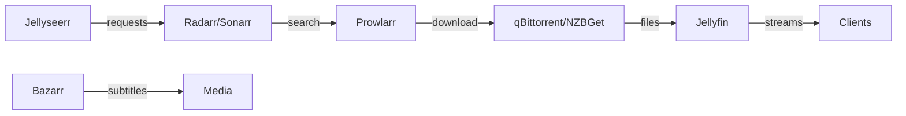

# 🏠 Homelab Master Plan: Comprehensive Research Analysis

## Executive Summary

This document consolidates three phases of comprehensive research across 19 homelab services, providing actionable insights for service optimization, network architecture, and configuration management.

### Research Scope
- **19 Services Analyzed**: From infrastructure (AdGuard, NPM) to media (Jellyfin, *arr stack) to security (Vaultwarden)
- **3 Research Phases**: Service Synergy, Networking Optimization, Configuration as Code
- **57 Documents Created**: Individual service analyses plus phase summaries

## 🎯 Top Priority Recommendations

### Immediate Actions (Week 1)
1. **Implement VLAN Segmentation**
   - Create 10 VLANs for proper network isolation
   - Move services to appropriate security zones
   - Critical: Separate download services behind VPN

2. **Deploy Authentication Layer**
   - Add Authelia or Authentik for Single Sign-On
   - Integrate with all web services
   - Enable 2FA for external access

3. **Setup Monitoring Stack**
   - Deploy Prometheus + Grafana
   - Add Uptime Kuma for service health
   - Configure alerting rules

### Quick Wins (Week 2-3)
1. **Service Integration Improvements**
   - Deploy MQTT broker for event-driven automation
   - Add Tdarr for automatic media transcoding
   - Implement Recyclarr for *arr configuration sync

2. **Security Hardening**
   - Remove privileged mode from Home Assistant
   - Implement fail2ban on Nginx Proxy Manager
   - Configure Tailscale ACLs

3. **Backup Implementation**
   - Deploy Duplicati for automated backups
   - Configure 3-2-1 backup strategy
   - Test restore procedures

## 📊 Phase 1: Service Synergy Findings

### Key Synergies Discovered

#### Authentication & Security
- **Central SSO**: All services can integrate with Authelia/Authentik
- **Secret Management**: Vaultwarden can store credentials for all services
- **VPN Protection**: Gluetun protects all download services

#### Media Ecosystem


#### Automation Opportunities
- Home Assistant + MQTT = Universal event bus
- Webhook integration between all *arr services
- API-driven automation with n8n addition

### Service Redundancies
- **Ollama WebUI vs Home Assistant**: Both have dashboard capabilities
- **AdGuard vs Pi-hole**: Consider consolidating to AdGuard only
- **Multiple download clients**: Evaluate need for both qBittorrent and NZBGet

### Recommended Additional Services

| Priority | Service | Purpose | Integration Points |
|----------|---------|---------|-------------------|
| HIGH | Authelia | SSO/2FA | All web services |
| HIGH | Prometheus | Metrics | All containers |
| HIGH | Grafana | Visualization | Prometheus, InfluxDB |
| MEDIUM | Mosquitto | MQTT Broker | Home Assistant, Node-RED |
| MEDIUM | Tdarr | Transcoding | Jellyfin, *arr stack |
| MEDIUM | Duplicati | Backups | All persistent data |
| LOW | n8n | Workflow Automation | All APIs |
| LOW | Paperless-ngx | Document Management | Samba shares |

## 🌐 Phase 2: Network Architecture

### Optimized VLAN Design

```
Internet
    │
    ├─── VLAN 100: DMZ
    │    └── Nginx Proxy Manager (172.20.100.2)
    │
    ├─── VLAN 5: Infrastructure
    │    └── AdGuard Home (172.20.5.2)
    │
    ├─── VLAN 10: Management
    │    ├── Tailscale (VPN Mesh)
    │    └── Glance Dashboard (172.20.10.2)
    │
    ├─── VLAN 20: Users
    │    └── User Devices/Workstations
    │
    ├─── VLAN 25: Security
    │    └── Vaultwarden (172.20.25.2)
    │
    ├─── VLAN 30: IoT
    │    └── Home Assistant (172.20.30.2)
    │
    ├─── VLAN 40: Media Services
    │    ├── Jellyfin (172.20.40.2)
    │    ├── Jellyseerr (172.20.40.3)
    │    ├── Radarr/Sonarr/Lidarr (172.20.40.4-6)
    │    └── Bazarr (172.20.40.7)
    │
    ├─── VLAN 41: Downloads (VPN-Only)
    │    ├── Gluetun (172.20.41.2)
    │    ├── qBittorrent (via Gluetun)
    │    ├── Prowlarr (via Gluetun)
    │    └── NZBGet (via Gluetun)
    │
    ├─── VLAN 50: Compute
    │    ├── Ollama (172.20.50.2)
    │    └── Ollama WebUI (172.20.50.3)
    │
    └─── VLAN 60: Storage
         └── Samba (172.20.60.2)
```

### Critical Firewall Rules

| Source VLAN | Destination VLAN | Ports | Direction | Purpose |
|-------------|-----------------|-------|-----------|---------|
| Users (20) | DMZ (100) | 80,443 | → | Web Access |
| DMZ (100) | Media (40) | Service Ports | → | Reverse Proxy |
| Media (40) | Downloads (41) | API Ports | → | Automation |
| Downloads (41) | Internet | VPN Only | → | Protected Traffic |
| All | Infrastructure (5) | 53 | → | DNS |
| Management (10) | All | All | ↔ | Administration |

### Reverse Proxy Strategy

#### Public Exposure (via Cloudflare + NPM)
- Jellyfin (streaming.domain.com)
- Jellyseerr (requests.domain.com)
- Vaultwarden (vault.domain.com)
- Home Assistant (home.domain.com)

#### VPN-Only Access (via Tailscale)
- All *arr services
- Download clients
- Admin interfaces
- Samba shares

## ⚙️ Phase 3: Configuration as Code

### Secrets Management Architecture

```yaml
Secrets Hierarchy:
  Level 1: GitHub Secrets (CI/CD)
    - HOMELAB_SSH_KEY
    - DOCKER_REGISTRY_TOKEN

  Level 2: Docker Secrets (Runtime)
    - Database passwords
    - API keys
    - Service tokens

  Level 3: Vaultwarden (Application)
    - User credentials
    - Service accounts
    - Shared secrets
```

### Resource Allocation Matrix

| Service | CPU Limit | Memory Limit | Storage | Priority |
|---------|-----------|--------------|---------|----------|
| Jellyfin | 4 cores | 8GB | 500GB+ | HIGH |
| Gluetun | 1 core | 512MB | 10GB | CRITICAL |
| *arr stack | 1 core each | 1GB each | 50GB each | MEDIUM |
| Home Assistant | 2 cores | 2GB | 100GB | HIGH |
| Ollama | 8 cores | 16GB | 200GB | LOW |
| AdGuard | 1 core | 512MB | 10GB | CRITICAL |
| NPM | 1 core | 512MB | 10GB | CRITICAL |

### Backup Strategy

```bash
Backup Tiers:
  Tier 1 (Daily): Configuration files, databases
  Tier 2 (Weekly): Application data, settings
  Tier 3 (Monthly): Media metadata, statistics

3-2-1 Rule Implementation:
  3 copies: Local + NAS + Cloud (Backblaze B2)
  2 different media: SSD + HDD
  1 offsite: Cloud backup
```

### GitOps Workflow

```yaml
Repository Structure:
/
├── .github/workflows/     # CI/CD pipelines
├── docker-compose/        # Service definitions
│   ├── base.yml          # Core services
│   ├── media.yml         # Media stack
│   └── monitoring.yml    # Observability
├── config/               # Service configurations
│   ├── [service]/       # Per-service configs
│   └── secrets/         # Encrypted secrets
├── scripts/             # Automation scripts
│   ├── backup.sh
│   ├── restore.sh
│   └── health-check.sh
└── docs/                # Documentation
```

## 📈 Implementation Roadmap

### Week 1: Foundation
- [ ] Implement VLAN segmentation
- [ ] Deploy AdGuard in infrastructure VLAN
- [ ] Setup Gluetun VPN for downloads
- [ ] Configure basic firewall rules

### Week 2: Security
- [ ] Deploy Authelia/Authentik
- [ ] Integrate SSO with services
- [ ] Setup Tailscale mesh
- [ ] Configure fail2ban

### Week 3: Monitoring
- [ ] Deploy Prometheus + Grafana
- [ ] Setup Uptime Kuma
- [ ] Configure alerts
- [ ] Create dashboards

### Week 4: Automation
- [ ] Implement GitOps workflow
- [ ] Setup automated backups
- [ ] Configure CI/CD pipeline
- [ ] Test disaster recovery

### Week 5: Optimization
- [ ] Fine-tune resource limits
- [ ] Optimize network performance
- [ ] Implement caching strategies
- [ ] Document everything

## 🔍 Monitoring & Maintenance

### Key Metrics to Track
- Service availability (>99.9% target)
- Response times (<100ms internal)
- Resource utilization (<80% sustained)
- Backup success rate (100% target)
- Security events (0 tolerance)

### Maintenance Windows
- **Daily**: Log rotation, temp cleanup
- **Weekly**: Container updates, backups verification
- **Monthly**: Security patches, performance review
- **Quarterly**: Full DR test, architecture review

## 🛡️ Security Baseline

### Mandatory Controls
1. All external access through reverse proxy
2. 2FA for administrative access
3. VPN-only for sensitive services
4. Encrypted backups
5. Regular security updates
6. Network segmentation
7. Least privilege access
8. Audit logging enabled

## 📚 Documentation Standards

### Required Documentation
- Service configuration guides
- Network topology diagrams
- Disaster recovery procedures
- Troubleshooting runbooks
- Change management log
- Security incident response plan

## 🎉 Conclusion

This comprehensive research provides a roadmap to transform your homelab into a production-grade, secure, and maintainable infrastructure. The phased approach ensures minimal disruption while maximizing improvements.

### Success Criteria
- ✅ All services properly segmented
- ✅ Automated backup and recovery
- ✅ Central authentication implemented
- ✅ Comprehensive monitoring active
- ✅ GitOps workflow operational
- ✅ Documentation complete

### Next Steps
1. Review and prioritize recommendations
2. Create implementation tickets
3. Begin Week 1 foundation tasks
4. Schedule regular review meetings
5. Iterate based on learnings

---

*Generated from 57 research documents across 19 services*
*Research completed: $(date)*