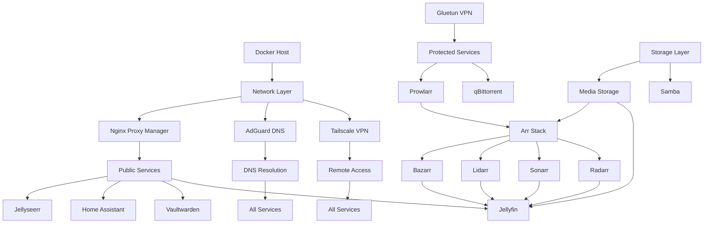

# Comprehensive Configuration Management Strategy

## Executive Summary

This document presents a comprehensive configuration management strategy for a 19-service homelab infrastructure, focusing on maintainability, security, reproducibility, and automation. The strategy encompasses configuration as code principles, secrets management, backup procedures, and GitOps workflows.

## 1. Configuration Management Architecture

### 1.1 Directory Structure

```
homelab/
├── docker-compose/
│   ├── docker-compose.yml          # Main orchestration file
│   ├── docker-compose.override.yml # Local overrides
│   └── docker-compose.prod.yml     # Production settings
├── config/
│   ├── [service_name]/             # Service-specific configs
│   └── templates/                  # Configuration templates
├── secrets/
│   ├── .gitignore                  # Exclude all secrets
│   ├── README.md                   # Secret generation guide
│   └── [service_name]/             # Service secrets
├── scripts/
│   ├── backup/                     # Backup scripts
│   ├── restore/                    # Restore scripts
│   ├── maintenance/                # Maintenance scripts
│   └── deployment/                 # Deployment scripts
├── ansible/
│   ├── playbooks/                  # Automation playbooks
│   ├── inventories/                # Host inventories
│   └── roles/                      # Ansible roles
├── terraform/
│   ├── main.tf                     # Infrastructure as Code
│   ├── variables.tf                # Variable definitions
│   └── modules/                    # Terraform modules
└── docs/
    ├── architecture/                # Architecture diagrams
    ├── runbooks/                    # Operational runbooks
    └── disaster-recovery/           # DR procedures
```

### 1.2 Service Categories

#### Critical Infrastructure (Priority 1)
- **Tailscale**: Network connectivity
- **AdGuard Home**: DNS resolution
- **Nginx Proxy Manager**: Reverse proxy and SSL

#### Core Services (Priority 2)
- **Vaultwarden**: Secrets management
- **Home Assistant**: Home automation
- **Jellyfin**: Media server

#### Support Services (Priority 3)
- **Gluetun**: VPN connectivity
- **Samba**: File sharing
- **Ollama + WebUI**: Local AI

#### Application Services (Priority 4)
- **Arr Stack**: Media management (Radarr, Sonarr, Lidarr, Prowlarr, Bazarr)
- **qBittorrent**: Download client
- **NZBGet**: Usenet downloads
- **Jellyseerr**: Request management
- **Byparr**: CloudFlare bypass
- **Glance**: Dashboard

## 2. Secrets Management Architecture

### 2.1 Hierarchical Secret Management

```yaml
# Secret Hierarchy
Level 1: Infrastructure Secrets
  - Database root passwords
  - Admin tokens
  - SSL certificates

Level 2: Service Secrets
  - API keys
  - Service passwords
  - Integration tokens

Level 3: User Secrets
  - User passwords
  - Personal API keys
  - OAuth tokens
```

### 2.2 Secret Storage Strategy

```yaml
# Docker Secrets (Production)
secrets:
  db_root_password:
    external: true
    external_name: homelab_db_root_password

# Environment Files (Development)
env_files:
  - ./secrets/.env.common
  - ./secrets/.env.${ENVIRONMENT}

# External Vault Integration
vault_integration:
  provider: "Vaultwarden"
  api_endpoint: "https://vault.local/api"
  auth_method: "token"
  secret_engine: "kv-v2"
  path_prefix: "homelab/"
```

### 2.3 Secret Rotation Policy

```yaml
rotation_schedule:
  critical:
    frequency: "30 days"
    services: ["vaultwarden", "nginx_proxy_manager", "database"]

  standard:
    frequency: "90 days"
    services: ["arr_stack", "jellyfin", "home_assistant"]

  low_priority:
    frequency: "180 days"
    services: ["glance", "jellyseerr"]

automated_rotation:
  enabled: true
  notification: "email,discord"
  rollback_on_failure: true
```

## 3. Backup and Disaster Recovery Plan

### 3.1 Backup Strategy Matrix

| Service | Data Type | Frequency | Retention | Storage | Priority |
|---------|-----------|-----------|-----------|---------|----------|
| Vaultwarden | Database, Keys | Every 4h | 30 days | Encrypted, Offsite | Critical |
| Home Assistant | Config, DB | Daily | 14 days | Local + Cloud | High |
| Jellyfin | Metadata, Config | Daily | 7 days | Local | Medium |
| Arr Stack | Config, DB | Daily | 7 days | Local | Medium |
| AdGuard | Config, Lists | Weekly | 4 weeks | Local | Low |
| Nginx PM | Config, Certs | Daily | 14 days | Local + Cloud | High |

### 3.2 Automated Backup Script

```bash
#!/bin/bash
# master_backup.sh

BACKUP_ROOT="/mnt/backups"
DATE=$(date +%Y%m%d_%H%M%S)
SERVICES=("vaultwarden" "homeassistant" "jellyfin" "npm" "adguard")

# Backup function
backup_service() {
    local service=$1
    local backup_dir="${BACKUP_ROOT}/${service}/${DATE}"

    mkdir -p "${backup_dir}"

    case $service in
        vaultwarden)
            docker exec vaultwarden sqlite3 /data/db.sqlite3 ".backup ${backup_dir}/db.sqlite3"
            cp -r /docker/vaultwarden/rsa_key* "${backup_dir}/"
            ;;
        homeassistant)
            docker exec homeassistant ha backup new --name "auto_${DATE}"
            ;;
        *)
            tar -czf "${backup_dir}/${service}_config.tar.gz" "/docker/${service}/config"
            ;;
    esac

    # Encrypt backup
    gpg --encrypt --recipient backup@homelab.local "${backup_dir}"/*

    # Upload to cloud
    rclone copy "${backup_dir}" "remote:backups/${service}/${DATE}"
}

# Execute backups in parallel
for service in "${SERVICES[@]}"; do
    backup_service "$service" &
done

wait
echo "Backup completed at $(date)"
```

### 3.3 Disaster Recovery Procedures

```yaml
# Recovery Time Objectives (RTO)
critical_services:
  rto: "1 hour"
  services: ["tailscale", "adguard", "nginx_proxy_manager", "vaultwarden"]

core_services:
  rto: "4 hours"
  services: ["homeassistant", "jellyfin", "gluetun"]

standard_services:
  rto: "24 hours"
  services: ["arr_stack", "qbittorrent", "jellyseerr"]

# Recovery Point Objectives (RPO)
data_loss_tolerance:
  critical: "4 hours"
  core: "24 hours"
  standard: "7 days"
```

## 4. Service Dependency Graph



## 5. Resource Allocation Matrix

### 5.1 CPU and Memory Allocation

| Service | CPU Limit | CPU Reserve | RAM Limit | RAM Reserve | Priority |
|---------|-----------|-------------|-----------|-------------|----------|
| Jellyfin | 4.0 cores | 1.0 core | 4096MB | 1024MB | High |
| Ollama | 4.0 cores | 2.0 cores | 16384MB | 8192MB | Medium |
| Home Assistant | 2.0 cores | 0.5 core | 2048MB | 512MB | High |
| Nginx PM | 2.0 cores | 0.5 core | 512MB | 256MB | Critical |
| Arr Stack (each) | 1.0 core | 0.25 core | 512MB | 256MB | Low |
| Gluetun | 0.5 core | 0.1 core | 256MB | 128MB | Medium |
| AdGuard | 1.0 core | 0.25 core | 512MB | 256MB | Critical |

### 5.2 Storage Allocation

```yaml
storage_pools:
  ssd_pool:
    size: "500GB"
    services:
      - jellyfin_transcodes: "100GB"
      - ollama_models: "200GB"
      - docker_volumes: "100GB"
      - cache: "100GB"

  hdd_pool:
    size: "10TB"
    allocation:
      - media_library: "8TB"
      - backups: "1TB"
      - downloads: "1TB"

  network_storage:
    type: "NAS"
    protocol: "SMB/NFS"
    redundancy: "RAID5"
```

## 6. Monitoring and Alerting Framework

### 6.1 Metrics Collection

```yaml
# Prometheus Configuration
prometheus:
  scrape_configs:
    - job_name: 'docker'
      static_configs:
        - targets: ['localhost:9323']

    - job_name: 'node_exporter'
      static_configs:
        - targets: ['localhost:9100']

    - job_name: 'services'
      static_configs:
        - targets:
          - 'jellyfin:8096/metrics'
          - 'homeassistant:8123/api/prometheus'
          - 'adguard:3000/control/stats'

# Grafana Dashboards
dashboards:
  - id: "system-overview"
    title: "Homelab System Overview"
    refresh: "30s"

  - id: "service-health"
    title: "Service Health Matrix"
    refresh: "1m"

  - id: "resource-usage"
    title: "Resource Utilization"
    refresh: "5m"
```

### 6.2 Alert Rules

```yaml
# Critical Alerts
critical_alerts:
  - name: "Service Down"
    condition: "up == 0"
    duration: "2m"
    services: ["nginx_proxy_manager", "adguard", "vaultwarden"]
    action: ["email", "pushover", "discord"]

  - name: "Disk Space Critical"
    condition: "disk_free < 10%"
    duration: "5m"
    action: ["email", "pushover"]

  - name: "Certificate Expiry"
    condition: "cert_expiry < 7d"
    duration: "1h"
    action: ["email", "discord"]

# Warning Alerts
warning_alerts:
  - name: "High CPU Usage"
    condition: "cpu_usage > 80%"
    duration: "10m"
    action: ["discord"]

  - name: "Memory Pressure"
    condition: "memory_usage > 90%"
    duration: "5m"
    action: ["discord"]
```

## 7. GitOps Workflow Recommendations

### 7.1 Repository Structure

```yaml
# Main Repository
homelab-infrastructure/
  branches:
    - main: "Production configuration"
    - staging: "Testing environment"
    - develop: "Development changes"

  protection_rules:
    main:
      - require_pull_request: true
      - require_review: true
      - require_ci_pass: true
      - no_force_push: true

# Secrets Repository (Private)
homelab-secrets/
  encryption: "git-crypt"
  access: "restricted"
  audit: "enabled"
```

### 7.2 CI/CD Pipeline

```yaml
# .github/workflows/deploy.yml
name: Deploy Homelab

on:
  push:
    branches: [main]
  pull_request:
    branches: [main]

jobs:
  validate:
    runs-on: ubuntu-latest
    steps:
      - uses: actions/checkout@v2

      - name: Validate Docker Compose
        run: docker-compose config -q

      - name: Lint Dockerfiles
        run: hadolint */Dockerfile

      - name: Security Scan
        run: trivy config .

  deploy:
    needs: validate
    if: github.ref == 'refs/heads/main'
    runs-on: self-hosted
    steps:
      - name: Deploy Services
        run: |
          docker-compose pull
          docker-compose up -d
          ./scripts/health-check.sh
```

### 7.3 Automated Configuration Updates

```bash
#!/bin/bash
# auto_update_configs.sh

# Pull latest configurations
git pull origin main

# Validate configurations
docker-compose config > /dev/null 2>&1 || exit 1

# Backup current state
./scripts/backup/quick_backup.sh

# Apply changes
docker-compose up -d --remove-orphans

# Verify health
sleep 30
./scripts/health-check.sh || {
    echo "Health check failed, rolling back"
    git reset --hard HEAD~1
    docker-compose up -d
    exit 1
}

echo "Configuration updated successfully"
```

## 8. Infrastructure as Code Templates

### 8.1 Docker Compose Template

```yaml
# docker-compose.template.yml
version: '3.8'

x-common-variables: &common-variables
  PUID: ${PUID:-1000}
  PGID: ${PGID:-1000}
  TZ: ${TZ:-America/New_York}

x-common-labels: &common-labels
  com.centurylinklabs.watchtower.enable: "true"
  traefik.enable: "true"

services:
  service_template:
    image: ${SERVICE_IMAGE}:${SERVICE_TAG:-latest}
    container_name: ${SERVICE_NAME}
    restart: ${RESTART_POLICY:-unless-stopped}
    environment:
      <<: *common-variables
      SERVICE_SPECIFIC_VAR: ${SERVICE_SPECIFIC_VAR}
    volumes:
      - ./config/${SERVICE_NAME}:/config
      - ./data/${SERVICE_NAME}:/data
    networks:
      - ${NETWORK:-default}
    labels:
      <<: *common-labels
      traefik.http.routers.${SERVICE_NAME}.rule: Host(`${SERVICE_NAME}.${DOMAIN}`)
    healthcheck:
      test: ${HEALTHCHECK_TEST:-["CMD", "curl", "-f", "http://localhost/health"]}
      interval: ${HEALTHCHECK_INTERVAL:-30s}
      timeout: ${HEALTHCHECK_TIMEOUT:-10s}
      retries: ${HEALTHCHECK_RETRIES:-3}
    deploy:
      resources:
        limits:
          cpus: '${CPU_LIMIT:-1.0}'
          memory: ${MEMORY_LIMIT:-512M}
        reservations:
          cpus: '${CPU_RESERVATION:-0.25}'
          memory: ${MEMORY_RESERVATION:-128M}
```

### 8.2 Terraform Infrastructure Template

```hcl
# main.tf
terraform {
  required_providers {
    docker = {
      source  = "kreuzwerker/docker"
      version = "~> 3.0"
    }
  }
}

# Docker Network
resource "docker_network" "homelab" {
  name = "homelab_network"
  driver = "bridge"
  ipam_config {
    subnet = "172.20.0.0/16"
    gateway = "172.20.0.1"
  }
}

# Service Module
module "service" {
  source = "./modules/docker_service"

  for_each = var.services

  service_name = each.key
  image = each.value.image
  environment = each.value.environment
  volumes = each.value.volumes
  networks = [docker_network.homelab.name]
  ports = each.value.ports

  resource_limits = {
    cpu = each.value.cpu_limit
    memory = each.value.memory_limit
  }
}

# Variables
variable "services" {
  type = map(object({
    image = string
    environment = map(string)
    volumes = list(string)
    ports = list(string)
    cpu_limit = string
    memory_limit = string
  }))
}
```

## 9. Configuration Validation Procedures

### 9.1 Pre-Deployment Validation

```bash
#!/bin/bash
# validate_config.sh

echo "=== Configuration Validation Suite ==="

# 1. Syntax Validation
echo "Checking Docker Compose syntax..."
docker-compose config > /dev/null || exit 1

# 2. Secret Existence
echo "Verifying required secrets..."
REQUIRED_SECRETS=(
    "ADMIN_PASSWORD"
    "DB_ROOT_PASSWORD"
    "JWT_SECRET"
)

for secret in "${REQUIRED_SECRETS[@]}"; do
    if [[ -z "${!secret}" ]]; then
        echo "ERROR: Missing required secret: $secret"
        exit 1
    fi
done

# 3. Network Connectivity
echo "Testing network prerequisites..."
nc -zv 1.1.1.1 53 || echo "WARNING: DNS connectivity issue"
nc -zv google.com 443 || echo "WARNING: Internet connectivity issue"

# 4. Storage Availability
echo "Checking storage requirements..."
REQUIRED_PATHS=(
    "/mnt/media"
    "/mnt/backups"
    "/docker/config"
)

for path in "${REQUIRED_PATHS[@]}"; do
    if [[ ! -d "$path" ]]; then
        echo "ERROR: Required path missing: $path"
        exit 1
    fi

    available=$(df -BG "$path" | awk 'NR==2 {print $4}' | sed 's/G//')
    if [[ $available -lt 10 ]]; then
        echo "WARNING: Low disk space on $path: ${available}GB"
    fi
done

# 5. Port Availability
echo "Checking port availability..."
PORTS=(80 443 53 8096 7878 8989 9696)

for port in "${PORTS[@]}"; do
    if lsof -i:$port > /dev/null 2>&1; then
        echo "WARNING: Port $port already in use"
    fi
done

echo "=== Validation Complete ==="
```

### 9.2 Post-Deployment Validation

```python
#!/usr/bin/env python3
# health_check.py

import requests
import time
import sys

# Service health endpoints
SERVICES = {
    'nginx_proxy_manager': {'url': 'http://localhost:81/api', 'expected': 200},
    'jellyfin': {'url': 'http://localhost:8096/health', 'expected': 200},
    'home_assistant': {'url': 'http://localhost:8123/api/', 'expected': 200},
    'adguard': {'url': 'http://localhost:3000/', 'expected': 200},
    'vaultwarden': {'url': 'http://localhost:8085/alive', 'expected': 200},
}

def check_service(name, config):
    """Check if a service is healthy"""
    try:
        response = requests.get(config['url'], timeout=5)
        if response.status_code == config['expected']:
            print(f"✓ {name}: OK")
            return True
        else:
            print(f"✗ {name}: Unexpected status {response.status_code}")
            return False
    except Exception as e:
        print(f"✗ {name}: Failed - {str(e)}")
        return False

def main():
    """Main health check routine"""
    print("Starting health checks...")
    time.sleep(10)  # Allow services to stabilize

    failed_services = []
    for name, config in SERVICES.items():
        if not check_service(name, config):
            failed_services.append(name)

    if failed_services:
        print(f"\nFailed services: {', '.join(failed_services)}")
        sys.exit(1)
    else:
        print("\nAll services healthy!")
        sys.exit(0)

if __name__ == '__main__':
    main()
```

## 10. Version Control Best Practices

### 10.1 Commit Standards

```yaml
# Conventional Commits
commit_types:
  - feat: "New feature or service"
  - fix: "Bug fix or issue resolution"
  - docs: "Documentation updates"
  - style: "Formatting changes"
  - refactor: "Code restructuring"
  - perf: "Performance improvements"
  - test: "Test additions or fixes"
  - chore: "Maintenance tasks"
  - security: "Security updates"

# Example commits
examples:
  - "feat(jellyfin): add hardware transcoding support"
  - "fix(nginx): resolve SSL certificate renewal issue"
  - "security(vaultwarden): update to patch CVE-2024-1234"
  - "docs(readme): add troubleshooting section for arr stack"
```

### 10.2 Branch Strategy

```yaml
# GitFlow-inspired branching
branches:
  main:
    description: "Production-ready configurations"
    protected: true
    auto_deploy: true

  develop:
    description: "Integration branch for features"
    protected: false
    auto_deploy: false

  feature/*:
    description: "New features or services"
    naming: "feature/service-name-description"
    merge_to: "develop"

  hotfix/*:
    description: "Urgent production fixes"
    naming: "hotfix/issue-description"
    merge_to: ["main", "develop"]

  release/*:
    description: "Release preparation"
    naming: "release/v1.2.3"
    merge_to: ["main", "develop"]
```

### 10.3 Code Review Checklist

```markdown
## Configuration Review Checklist

### Security
- [ ] No hardcoded secrets or passwords
- [ ] Proper file permissions (PUID/PGID)
- [ ] Network isolation configured
- [ ] SSL/TLS enabled where applicable
- [ ] API keys stored in secrets management

### Performance
- [ ] Resource limits defined
- [ ] Health checks configured
- [ ] Appropriate restart policies
- [ ] Volume mounts optimized

### Maintainability
- [ ] Service documented in README
- [ ] Environment variables documented
- [ ] Backup procedure defined
- [ ] Update strategy specified

### Integration
- [ ] Service dependencies defined
- [ ] Network connectivity verified
- [ ] Monitoring endpoints exposed
- [ ] Logging configured
```

## 11. Maintenance Windows and Procedures

### 11.1 Maintenance Schedule

```yaml
# Maintenance Windows
regular_maintenance:
  frequency: "Weekly"
  day: "Sunday"
  time: "03:00-05:00 UTC"
  activities:
    - Update container images
    - Rotate logs
    - Clean caches
    - Verify backups

security_updates:
  frequency: "As needed"
  max_delay: "24 hours"
  critical_max_delay: "4 hours"

major_upgrades:
  frequency: "Monthly"
  day: "First Sunday"
  time: "02:00-06:00 UTC"
  activities:
    - OS updates
    - Docker updates
    - Major service upgrades
```

### 11.2 Maintenance Automation

```bash
#!/bin/bash
# maintenance.sh

# Maintenance log
LOG_FILE="/var/log/homelab/maintenance.log"
exec 1> >(tee -a "$LOG_FILE")
exec 2>&1

echo "=== Starting Maintenance: $(date) ==="

# 1. Update all container images
echo "Updating container images..."
docker-compose pull

# 2. Cleanup unused resources
echo "Cleaning up Docker resources..."
docker system prune -af --volumes
docker image prune -af

# 3. Rotate logs
echo "Rotating logs..."
find /docker/*/logs -name "*.log" -mtime +7 -delete

# 4. Update services with zero downtime
echo "Updating services..."
for service in $(docker-compose ps --services); do
    echo "Updating $service..."
    docker-compose up -d --no-deps --build $service
    sleep 10
done

# 5. Verify all services are healthy
echo "Verifying service health..."
./scripts/health-check.sh

# 6. Generate maintenance report
echo "Generating report..."
docker-compose ps > /tmp/service_status.txt
df -h > /tmp/disk_usage.txt

echo "=== Maintenance Complete: $(date) ==="
```

## 12. Compliance and Security Policies

### 12.1 Security Baseline

```yaml
security_requirements:
  authentication:
    - Multi-factor authentication for admin access
    - API key rotation every 90 days
    - Password complexity requirements

  encryption:
    - TLS 1.2 minimum for all web services
    - Encrypted storage for sensitive data
    - VPN for remote access

  network:
    - Network segmentation (VLANs)
    - Firewall rules (deny by default)
    - Rate limiting on public endpoints

  monitoring:
    - Failed login attempt tracking
    - Audit logging for configuration changes
    - Regular vulnerability scanning
```

### 12.2 Compliance Checklist

```yaml
compliance_checks:
  daily:
    - Verify SSL certificates validity
    - Check for security updates
    - Review access logs

  weekly:
    - Audit user permissions
    - Review firewall rules
    - Scan for vulnerabilities

  monthly:
    - Password rotation check
    - Security patch assessment
    - Compliance report generation
```

## Conclusion

This comprehensive configuration management strategy provides a robust framework for managing a complex homelab infrastructure. Key benefits include:

1. **Reproducibility**: All configurations are version-controlled and templated
2. **Security**: Multi-layered secrets management and security policies
3. **Reliability**: Automated backups and disaster recovery procedures
4. **Maintainability**: Clear documentation and standardized procedures
5. **Scalability**: Resource management and monitoring frameworks
6. **Automation**: GitOps workflows and CI/CD pipelines

Regular review and updates of this strategy ensure the homelab infrastructure remains secure, efficient, and aligned with evolving requirements.

## Appendix A: Quick Reference Commands

```bash
# Service Management
docker-compose up -d [service]           # Start service
docker-compose down [service]            # Stop service
docker-compose restart [service]         # Restart service
docker-compose logs -f [service]         # View logs

# Backup Operations
./scripts/backup/full_backup.sh          # Full backup
./scripts/backup/service_backup.sh [service]  # Service backup
./scripts/restore/restore_service.sh [service] [date]  # Restore

# Maintenance
./scripts/maintenance/update_all.sh      # Update all services
./scripts/maintenance/cleanup.sh         # Clean resources
./scripts/maintenance/health_check.sh    # Check health

# Configuration
./scripts/config/validate.sh             # Validate configs
./scripts/config/deploy.sh               # Deploy changes
./scripts/config/rollback.sh             # Rollback changes
```

## Appendix B: Troubleshooting Guide

### Common Issues and Solutions

| Issue | Symptoms | Solution |
|-------|----------|----------|
| Service won't start | Container exits immediately | Check logs: `docker logs [container]` |
| Network connectivity | Cannot access service | Verify port mapping and firewall rules |
| High resource usage | Slow performance | Check limits: `docker stats` |
| SSL certificate issues | HTTPS errors | Renew cert: `docker exec npm certbot renew` |
| Database corruption | Service errors | Restore from backup |
| Disk space full | Write errors | Clean up: `docker system prune -a` |

## Appendix C: Emergency Contacts and Procedures

```yaml
emergency_procedures:
  critical_failure:
    - Stop affected services
    - Isolate from network if security breach
    - Restore from last known good backup
    - Document incident

  data_corruption:
    - Stop writes immediately
    - Identify scope of corruption
    - Restore from backup
    - Verify data integrity

  security_breach:
    - Change all passwords
    - Rotate all API keys
    - Review access logs
    - Implement additional security measures
```