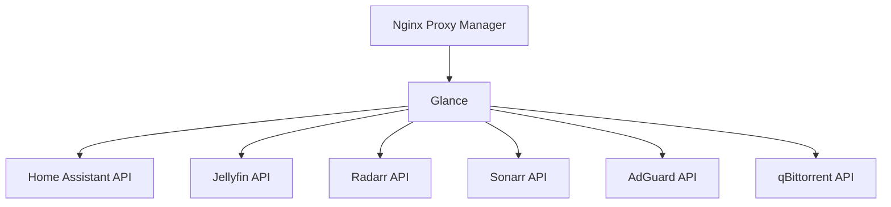

# Glance - Networking Optimization

## Current Network Configuration

### Service Ports
- **Default Port**: 8080 (HTTP)
- **Protocol**: HTTP/HTTPS via reverse proxy
- **Container Network**: Bridge or custom network

## Optimal Network Placement

### Network Architecture
```yaml
Network Placement:
  Primary: services_network (internal)
  Secondary: frontend_network (proxy access)
  Isolation: No direct internet access needed
```

### Recommended Network Mode
- **Type**: Bridge network with service discovery
- **Reasoning**: Needs to communicate with multiple services but doesn't require host networking

## Network Segmentation Strategy

### VLAN Configuration
```yaml
VLAN Assignment:
  Management VLAN: No (not critical infrastructure)
  Services VLAN: Yes (primary placement)
  DMZ VLAN: No (internal only)
  IoT VLAN: No
```

### Service Communication Matrix


## Reverse Proxy Configuration

### Nginx Proxy Manager Settings
```nginx
# Optimal NPM Configuration
location / {
    proxy_pass http://glance:8080;
    proxy_set_header Host $host;
    proxy_set_header X-Real-IP $remote_addr;
    proxy_set_header X-Forwarded-For $proxy_add_x_forwarded_for;
    proxy_set_header X-Forwarded-Proto $scheme;

    # WebSocket support for real-time updates
    proxy_http_version 1.1;
    proxy_set_header Upgrade $http_upgrade;
    proxy_set_header Connection "upgrade";

    # Caching for static assets
    location ~* \.(css|js|jpg|jpeg|png|gif|ico|woff|woff2)$ {
        proxy_cache STATIC;
        proxy_cache_valid 200 1d;
        proxy_cache_use_stale error timeout invalid_header updating;
        add_header X-Cache-Status $upstream_cache_status;
    }
}

# Security headers
add_header X-Frame-Options "SAMEORIGIN";
add_header X-Content-Type-Options "nosniff";
add_header X-XSS-Protection "1; mode=block";
add_header Referrer-Policy "strict-origin-when-cross-origin";
```

### Access Control
```yaml
Access Rules:
  Internal: Full access
  Tailscale: Full access
  External: Optional with authentication
  Public: Not recommended
```

## Security Considerations

### Firewall Rules
```yaml
Inbound:
  - Allow: 8080/tcp from services_network
  - Allow: 8080/tcp from reverse_proxy
  - Deny: All other

Outbound:
  - Allow: HTTPS to service APIs
  - Allow: DNS queries
  - Deny: Direct internet access
```

### Network Policies
1. **API Access**: Read-only where possible
2. **Rate Limiting**: 100 requests/minute per IP
3. **IP Whitelisting**: For sensitive widgets
4. **SSL/TLS**: Mandatory via reverse proxy

## Port Management

### Port Mapping Strategy
```yaml
Container Ports:
  Internal: 8080 (container)
  External: Not exposed directly
  Proxy: Via NPM on 443/80

Service Discovery:
  Method: Docker DNS
  Hostname: glance
  Resolution: Internal only
```

### Conflict Avoidance
- No port conflicts as service runs on standard 8080
- Use reverse proxy subdomains/paths for external access
- Internal communication via Docker DNS names

## DNS Configuration

### Local DNS Setup
```yaml
AdGuard Home:
  Local DNS Records:
    - glance.local → container_ip
    - dashboard.local → container_ip

Split DNS:
  Internal: glance.local
  External: glance.domain.com (via NPM)
```

### Service Discovery
```yaml
Docker DNS:
  Network: services_network
  Hostname: glance
  Aliases: [dashboard, glance-dashboard]
```

## Performance Optimization

### Network Tuning
```yaml
Container Settings:
  Network Buffer: 4MB
  Connection Limit: 1000
  Timeout: 30s for API calls

API Optimization:
  Parallel Requests: Yes
  Connection Pooling: Enabled
  Keep-Alive: 60s
  Cache Headers: Respect
```

### Bandwidth Management
```yaml
QoS Priority: Low
Bandwidth Limits:
  API Calls: 10Mbps
  Static Assets: Unlimited
  Updates: 1Mbps
```

## High Availability

### Load Balancing
```yaml
Strategy: Not required (single instance sufficient)
Fallback: Static page with service status
Monitoring: Health check endpoint
```

### Failover Configuration
```yaml
Health Check:
  Endpoint: /health
  Interval: 30s
  Timeout: 5s
  Failures: 3 before marked down
```

## Service Dependencies

### Network Requirements
```yaml
Required Services:
  - Docker DNS resolution
  - Reverse proxy (NPM)
  - API access to monitored services

Optional Services:
  - AdGuard for local DNS
  - Redis for caching
```

### Connection Patterns
```yaml
Connection Types:
  HTTP/HTTPS: Service APIs
  WebSocket: Real-time updates
  DNS: Name resolution
```

## Monitoring & Troubleshooting

### Network Monitoring
```yaml
Metrics to Track:
  - API response times
  - Failed connections
  - DNS resolution time
  - Bandwidth usage
  - WebSocket connections

Tools:
  - Prometheus metrics
  - Docker logs
  - NPM access logs
```

### Common Issues
1. **API Timeouts**: Increase timeout values
2. **CORS Errors**: Configure proxy headers
3. **WebSocket Failures**: Enable upgrade headers
4. **DNS Resolution**: Use IP addresses as fallback
5. **SSL Errors**: Verify certificate chain

## Implementation Checklist

### What Needs to Be Done
1. Place in services_network for API access
2. Configure NPM reverse proxy with caching
3. Set up WebSocket support for real-time
4. Implement rate limiting for security
5. Configure health check endpoint

### Why These Changes Are Beneficial
1. Isolates dashboard from direct internet
2. Enables efficient API communication
3. Provides secure external access
4. Optimizes performance with caching
5. Ensures reliable service discovery

### How to Implement
```yaml
# Docker Compose Network Configuration
services:
  glance:
    container_name: glance
    networks:
      - services_network
      - proxy_network
    environment:
      - TZ=${TZ}
    labels:
      - "traefik.enable=true"
      - "traefik.http.routers.glance.rule=Host(`glance.${DOMAIN}`)"
      - "traefik.http.routers.glance.tls=true"

networks:
  services_network:
    name: services
    driver: bridge
  proxy_network:
    name: proxy
    external: true
```