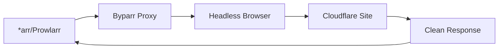

# Byparr - Service Synergy Analysis

## Service Overview
Byparr is a Cloudflare bypass proxy that helps services navigate through Cloudflare protection, DDoS-Guard, and other anti-bot mechanisms, ensuring automated tools can access protected websites.

## Synergies with Other Services

### Strong Integrations
1. **Prowlarr**: Bypass protection on indexer sites
2. **Radarr/Sonarr/Lidarr**: Access protected metadata sources
3. **Bazarr**: Reach protected subtitle sites
4. **Gluetun**: Combined VPN + Cloudflare bypass
5. **qBittorrent**: Access protected tracker sites
6. **Jellyseerr**: Fetch data from protected sources

### Complementary Services
- **AdGuard Home**: DNS resolution for bypass
- **Nginx Proxy Manager**: Proxy chain configuration
- **Home Assistant**: Monitor bypass success rate
- **Glance**: Display bypass statistics
- **Ollama**: Analyze bypass patterns
- **Tailscale**: Secure bypass access

## Redundancies
- **FlareSolverr**: Similar Cloudflare bypass tool
- **CloudScraper**: Python-based alternative
- **Puppeteer**: Browser automation alternative
- **Selenium**: Another browser automation option

## Recommended Additional Services

### High Priority
1. **FlareSolverr**: Alternative/backup bypass solution
2. **2Captcha**: CAPTCHA solving service
3. **Anti-Captcha**: Alternative CAPTCHA solver
4. **Rotating Proxies**: IP rotation for rate limits
5. **Headless Chrome**: Browser automation

### Medium Priority
1. **Playwright**: Modern browser automation
2. **CloudProxy**: Another bypass proxy
3. **CAPTCHA Harvester**: Manual solving interface
4. **ProxyMesh**: Rotating proxy service
5. **Bright Data**: Premium proxy network

### Low Priority
1. **Scrapy**: Web scraping framework
2. **Splash**: JavaScript rendering service
3. **ScrapingBee**: Managed scraping API
4. **Crawlera**: Smart proxy rotation
5. **WebScrapingAPI**: Managed bypass service

## Integration Opportunities

### Bypass Architecture


### Protection Types Handled
1. **Cloudflare Challenges**:
   - JavaScript challenges
   - CAPTCHA challenges
   - Rate limiting
   - Browser verification

2. **Other Protections**:
   - DDoS-Guard
   - Sucuri WAF
   - Custom anti-bot systems
   - Geographic restrictions

3. **CAPTCHA Types**:
   - reCAPTCHA v2/v3
   - hCaptcha
   - FunCaptcha
   - Custom CAPTCHAs

## Optimization Recommendations

### Configuration
```yaml
Byparr Settings:
  Browser: Chrome/Firefox
  Headless: True
  Timeout: 60 seconds
  Max Attempts: 3
  User Agent: Rotate
  Sessions: Persistent

Proxy Settings:
  Type: HTTP/SOCKS5
  Rotation: Per request
  Geographic: Match target

CAPTCHA:
  Service: 2Captcha/Anti-Captcha
  Auto-solve: Enabled
  Manual Fallback: Yes
```

### Performance Tuning
1. **Browser Pool**: Multiple instances
2. **Session Caching**: Reuse cookies
3. **Response Caching**: Short-term cache
4. **Parallel Processing**: Multiple requests
5. **Resource Optimization**: Disable images/CSS

### Integration Configuration

#### With Prowlarr
```yaml
Proxy Settings:
  Type: HTTP
  Host: byparr
  Port: 8191
  Tags: cf-bypass
  Test: Verify working
```

#### With *arr Services
```yaml
HTTP Settings:
  Proxy: Enabled
  Type: HTTP
  Host: byparr
  Port: 8191
  Bypass for Local: Yes
```

## Advanced Features

### Session Management
1. **Cookie Persistence**: Maintain sessions
2. **Token Storage**: Save auth tokens
3. **Rate Limit Tracking**: Avoid bans
4. **IP Rotation**: Prevent blocking
5. **User Agent Rotation**: Avoid detection

### Challenge Solving
```yaml
Strategies:
  JavaScript:
    - Execute challenge code
    - Wait for redirect
    - Extract clearance cookie

  CAPTCHA:
    - Attempt auto-solve
    - Use solving service
    - Manual intervention

  Rate Limit:
    - Implement backoff
    - Rotate IP/session
    - Queue requests
```

### Monitoring & Logging
1. **Success Rate**: Track bypass effectiveness
2. **Response Time**: Monitor performance
3. **Error Types**: Categorize failures
4. **Cost Tracking**: CAPTCHA solving expenses
5. **Pattern Analysis**: Identify changes

## Service-Specific Benefits

### For Indexers (Prowlarr)
- Access Cloudflare-protected trackers
- Bypass rate limiting on searches
- Handle CAPTCHA challenges
- Maintain session cookies

### For Metadata (*arr Services)
- Access protected API endpoints
- Bypass geographic restrictions
- Handle provider rate limits
- Solve verification challenges

### For Subtitles (Bazarr)
- Access protected subtitle sites
- Bypass download restrictions
- Handle CAPTCHA on downloads
- Maintain provider sessions

## Implementation Patterns

### Failover Strategy
```yaml
Primary Path:
  1. Direct request
  2. If blocked → Byparr
  3. If failed → FlareSolverr
  4. If failed → Manual intervention

Retry Logic:
  - Exponential backoff
  - Maximum 3 attempts
  - Alert on persistent failure
```

### Cost Management
1. **CAPTCHA Budget**: Set monthly limits
2. **Selective Use**: Only when needed
3. **Caching**: Reuse solved challenges
4. **Manual Queue**: For expensive solves
5. **Analytics**: Track cost per service

## Performance Optimization

### Resource Management
1. **Browser Instances**: Pool management
2. **Memory Limits**: Prevent leaks
3. **CPU Allocation**: Balance load
4. **Disk Cache**: Temporary files
5. **Network**: Connection pooling

### Speed Optimization
1. **Preemptive Solving**: Background queue
2. **Parallel Browsers**: Multiple sessions
3. **Smart Routing**: Direct when possible
4. **Cache Headers**: Respect cache control
5. **Compression**: Reduce transfer size

## Key Findings

### What Needs to Be Done
1. Deploy Byparr with browser support
2. Configure CAPTCHA solving service
3. Set up proxy rotation if needed
4. Integrate with Prowlarr and *arr services
5. Monitor bypass success rates

### Why These Changes Are Beneficial
1. Ensures access to protected sources
2. Automates CAPTCHA solving
3. Prevents service disruptions
4. Maintains automation workflows
5. Reduces manual intervention

### How to Implement
1. Deploy Byparr container with browser
2. Configure solving service credentials
3. Set up proxy in Prowlarr
4. Configure *arr services to use proxy
5. Test with protected sites
6. Monitor success rates
7. Set up cost alerts
8. Configure fallback options
9. Document bypass patterns
10. Regular maintenance schedule