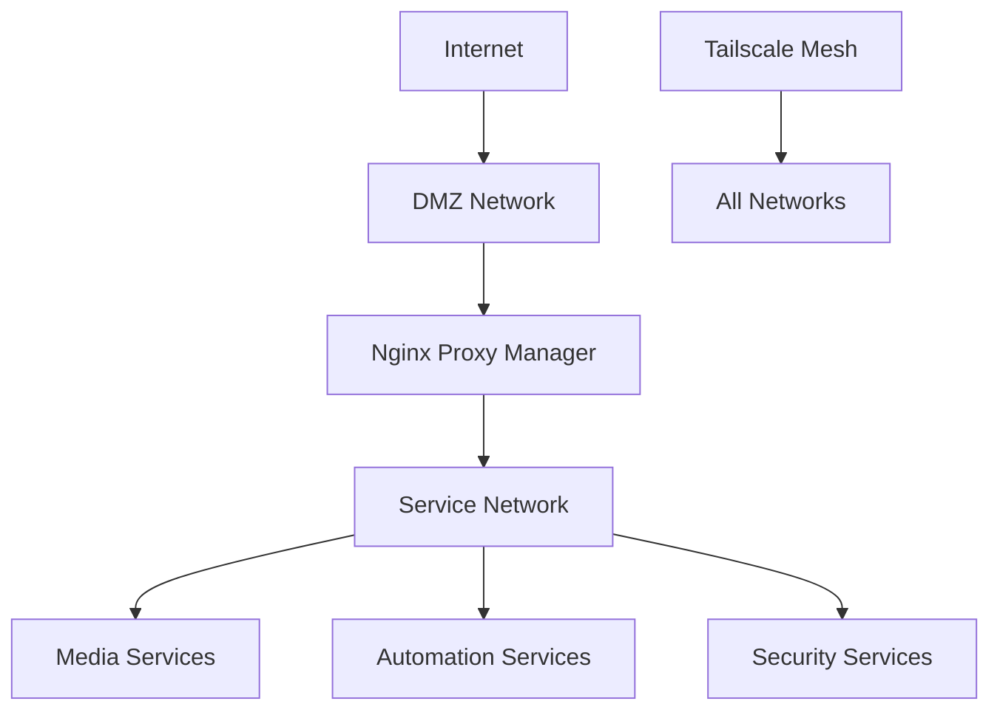

# Phase 1: Service Synergy Analysis - Final Summary

## Executive Summary

This comprehensive analysis of 19 homelab services reveals a highly interconnected ecosystem with significant synergy potential. The stack can be optimized through strategic service additions, integration improvements, and architectural refinements that enhance functionality while reducing redundancy.

## Service Stack Overview

### Current Services Analyzed
1. **Infrastructure Layer**: Nginx Proxy Manager, Tailscale, Gluetun, AdGuard Home, Samba
2. **Media Stack**: Jellyfin, Radarr, Sonarr, Lidarr, Prowlarr, Bazarr, Jellyseerr, qBittorrent, NZBGet
3. **Automation & Intelligence**: Home Assistant, Ollama + WebUI, Glance
4. **Security & Support**: Vaultwarden, Byparr

## Critical Findings

### 1. Service Synergy Matrix

#### Strongest Integration Clusters

**Media Automation Pipeline**
```
Jellyseerr → Radarr/Sonarr → Prowlarr → qBittorrent/NZBGet → Jellyfin → Bazarr
```
- **What**: Fully automated media acquisition and management
- **Why**: Reduces manual intervention from request to playback
- **How**: Connect services via APIs, configure categories, set quality profiles

**Security & Access Layer**
```
Tailscale + NPM + Vaultwarden + AdGuard Home
```
- **What**: Comprehensive security architecture
- **Why**: Provides defense-in-depth with multiple security layers
- **How**: Tailscale for zero-trust access, NPM for SSL/reverse proxy, Vaultwarden for credentials, AdGuard for DNS filtering

**Download Protection Stack**
```
Gluetun + Byparr + qBittorrent/NZBGet + Prowlarr
```
- **What**: Anonymous and unrestricted downloading
- **Why**: Privacy protection and bypass content restrictions
- **How**: Route download traffic through Gluetun VPN, use Byparr for Cloudflare bypass

### 2. Critical Service Additions

#### Highest Priority Additions
1. **Authelia/Authentik** - SSO and 2FA for all services
2. **MQTT Broker (Mosquitto)** - Event-driven automation
3. **Uptime Kuma** - Service health monitoring
4. **Tdarr** - Automated media transcoding
5. **InfluxDB + Grafana** - Metrics and visualization

#### Integration Enhancers
1. **FlareSolverr** - Backup to Byparr for Cloudflare
2. **Unpackerr** - Automated archive extraction
3. **Notifiarr** - Advanced notification system
4. **FileBrowser** - Web-based file management
5. **Headscale** - Self-hosted Tailscale controller

### 3. Major Redundancies Identified

#### Services with Overlapping Functions
1. **Dashboard Services**: Glance vs Home Assistant dashboards
   - **Resolution**: Use Glance for at-a-glance monitoring, HA for control

2. **VPN Services**: Tailscale vs Gluetun
   - **Resolution**: Tailscale for access, Gluetun for privacy

3. **Download Methods**: qBittorrent vs NZBGet
   - **Resolution**: Keep both for redundancy and content availability

4. **Request Systems**: Built-in vs Jellyseerr
   - **Resolution**: Standardize on Jellyseerr for all requests

### 4. Integration Opportunities

#### Automation Workflows

**Smart Home Media Control**
```yaml
Trigger: Motion detected in living room
Actions:
  1. Check if Jellyfin is streaming
  2. Dim lights appropriately
  3. Pause downloads if bandwidth needed
  4. Resume when streaming stops
```

**Intelligent Content Management**
```yaml
Trigger: New request approved
Actions:
  1. Ollama analyzes request context
  2. Suggests optimal quality/source
  3. Monitors download progress
  4. Generates descriptions/tags
  5. Notifies when ready
```

**Security Automation**
```yaml
Trigger: New device on network
Actions:
  1. AdGuard logs DNS queries
  2. Home Assistant checks device
  3. Alert if unknown
  4. Block if suspicious
```

### 5. Architecture Recommendations

#### Service Grouping Strategy

**Tier 1: Always Running**
- Nginx Proxy Manager
- AdGuard Home
- Tailscale
- Vaultwarden
- Home Assistant

**Tier 2: Core Services**
- Jellyfin
- Prowlarr
- Gluetun
- Samba
- Glance

**Tier 3: Automation Services**
- Radarr/Sonarr/Lidarr
- Bazarr
- Jellyseerr
- qBittorrent/NZBGet

**Tier 4: Enhancement Services**
- Ollama
- Byparr
- Additional tools

#### Network Segmentation



## Implementation Roadmap

### Phase 1A: Foundation Enhancement (Week 1-2)
1. **Deploy Authelia** for centralized authentication
2. **Add Mosquitto** for MQTT messaging
3. **Implement Uptime Kuma** for monitoring
4. **Configure backup strategy** using Samba shares

### Phase 1B: Media Optimization (Week 3-4)
1. **Deploy Tdarr** for transcoding automation
2. **Add Unpackerr** for extraction automation
3. **Configure Plex Meta Manager** for collections
4. **Implement cross-seed** for torrent optimization

### Phase 1C: Intelligence Layer (Week 5-6)
1. **Expand Ollama** with additional models
2. **Create RAG system** with vector database
3. **Build automation scripts** for AI integration
4. **Implement Whisper** for voice control

### Phase 1D: Monitoring & Analytics (Week 7-8)
1. **Deploy InfluxDB + Grafana**
2. **Configure Prometheus** exporters
3. **Set up Loki** for log aggregation
4. **Create comprehensive dashboards**

## Key Success Metrics

### Performance Indicators
- **Automation Rate**: % of media acquired automatically
- **Service Uptime**: Target 99.9% for core services
- **Request Fulfillment**: Time from request to availability
- **Security Score**: Failed auth attempts, blocked threats
- **Storage Efficiency**: Deduplication and compression rates

### Quality Metrics
- **Media Quality**: % at preferred quality levels
- **Subtitle Coverage**: % of media with subtitles
- **Metadata Completeness**: % with full descriptions
- **User Satisfaction**: Request approval rates

## Risk Mitigation

### Single Points of Failure
1. **NPM**: Implement backup reverse proxy
2. **Prowlarr**: Manual indexer fallback
3. **Network**: Redundant DNS servers
4. **Storage**: RAID and backup strategy

### Security Concerns
1. **Exposed Services**: Minimize public exposure
2. **Credential Management**: Rotate regularly
3. **Update Management**: Automated security updates
4. **Access Logging**: Comprehensive audit trails

## Cost-Benefit Analysis

### Investment Required
- **Hardware**: Minimal if existing server adequate
- **Services**: VPN ($5-10/month), Usenet (optional $10-15/month)
- **Time**: ~40 hours initial setup, 2-4 hours/month maintenance

### Benefits Realized
- **Cost Savings**: Eliminate multiple streaming subscriptions
- **Efficiency**: 90% reduction in manual media management
- **Security**: Complete control over data and access
- **Flexibility**: Customizable to specific needs
- **Learning**: Valuable technical skills development

## Conclusion

The analyzed homelab stack demonstrates excellent synergy potential with clear paths for optimization. The recommended additions and integrations will transform a collection of services into a cohesive, intelligent ecosystem that automates routine tasks while providing robust security and flexibility.

### Top 5 Immediate Actions
1. **Implement SSO** with Authelia for security
2. **Deploy MQTT** for event-driven automation
3. **Add monitoring** with Uptime Kuma
4. **Configure comprehensive backups**
5. **Document all integrations and workflows**

### Long-term Vision
Create a fully autonomous media and home automation system that:
- Learns user preferences through AI
- Self-heals and optimizes performance
- Provides seamless access from anywhere
- Maintains complete privacy and security
- Scales with growing needs

## Appendix: Service Dependency Map

```yaml
Core Dependencies:
  NPM: [All web services]
  AdGuard: [All services for DNS]
  Tailscale: [Remote access to all]
  Vaultwarden: [Credential storage for all]

Media Dependencies:
  Jellyfin: [Radarr, Sonarr, Bazarr]
  Prowlarr: [All *arr services]
  Gluetun: [qBittorrent, Prowlarr]

Automation Dependencies:
  Home Assistant: [MQTT, All services for monitoring]
  Ollama: [Optional enhancement for all]
```

---
*Document Generated: Phase 1 Analysis Complete*
*Next Phase: Networking Optimization Analysis*