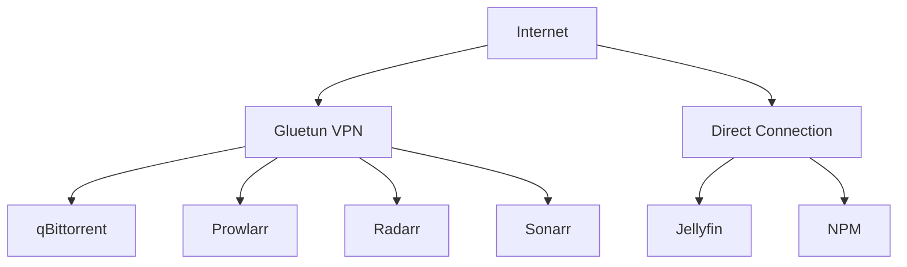

# Gluetun - Service Synergy Analysis

## Service Overview
Gluetun is a VPN client container that provides a secure tunnel for other containers, supporting multiple VPN providers with features like port forwarding, kill switch, and DNS over TLS.

## Synergies with Other Services

### Strong Integrations
1. **qBittorrent**: Routes all torrent traffic through VPN for privacy
2. **Prowlarr**: Protects indexer searches from ISP monitoring
3. **Radarr/Sonarr/Lidarr**: Secure metadata fetching and searches
4. **NZBGet**: Anonymous Usenet downloading
5. **Byparr**: Combined with Cloudflare bypass for maximum anonymity
6. **AdGuard Home**: DNS leak prevention and encrypted DNS

### Complementary Services
- **Home Assistant**: VPN status monitoring and automation
- **Glance**: Display VPN connection status and location
- **Tailscale**: Different VPN purpose (access vs. privacy)
- **Nginx Proxy Manager**: Selective routing through VPN
- **Jellyfin**: Geo-unblocking for metadata providers

## Redundancies
- **Service Built-in Proxies**: Some services have proxy support
- **Tailscale Exit Nodes**: Can provide similar functionality
- **Direct VPN Clients**: Individual service VPN configurations

## Recommended Additional Services

### High Priority
1. **WireGuard**: Lightweight VPN protocol support
2. **OpenVPN**: Broader provider compatibility
3. **Shadowsocks**: Obfuscated proxy for restrictive networks
4. **V2Ray**: Advanced proxy with multiple protocols
5. **ProxyChains**: Route specific applications through proxy

### Medium Priority
1. **Tor**: Additional anonymity layer
2. **I2P**: Alternative anonymous network
3. **DNSCrypt**: Encrypted DNS queries
4. **Stubby**: DNS over TLS client
5. **SoftEther**: Multi-protocol VPN support

### Low Priority
1. **SOCKS5 Proxy**: Lighter alternative for specific needs
2. **HTTP Proxy**: Simple proxy for HTTP traffic
3. **Squid**: Caching proxy server
4. **Dante**: SOCKS server implementation
5. **Privoxy**: Privacy-enhancing proxy

## Integration Opportunities

### Network Architecture


### Container Networking
1. **Network_mode: service:gluetun**:
   ```yaml
   qbittorrent:
     network_mode: service:gluetun
     depends_on:
       - gluetun
   ```

2. **Selective Routing**:
   - Download services through VPN
   - Streaming services direct
   - Management interfaces local only

3. **Kill Switch Implementation**:
   - No internet if VPN disconnects
   - Automatic container restart
   - Notification on failure

### Multi-VPN Strategy
1. **Provider Redundancy**:
   - Primary: Fast provider for downloads
   - Backup: Alternative for failover
   - Specialty: Specific country servers

2. **Purpose-Based VPNs**:
   - Torrenting: P2P-friendly provider
   - Streaming: Geo-unblocking optimized
   - Privacy: No-logs jurisdiction

## Optimization Recommendations

### Configuration Best Practices
```yaml
environment:
  - VPN_SERVICE_PROVIDER=custom
  - VPN_TYPE=wireguard
  - KILL_SWITCH=on
  - DNS_OVER_TLS=on
  - BLOCK_MALICIOUS=on
  - BLOCK_ADS=off  # Using AdGuard
  - FIREWALL_OUTBOUND_SUBNETS=192.168.1.0/24
  - PORT_FORWARD=on
```

### Performance Optimization
1. **Protocol Selection**: WireGuard > OpenVPN for speed
2. **Server Selection**: Closest with port forwarding
3. **MTU Optimization**: Adjust for best throughput
4. **Split Tunneling**: Only route necessary traffic
5. **DNS Configuration**: Use provider DNS to prevent leaks

### Security Hardening
1. **Kill Switch**: Always enabled for privacy
2. **DNS Leak Protection**: Force VPN DNS
3. **IPv6 Disable**: Prevent IPv6 leaks
4. **WebRTC Blocking**: Prevent IP leaks
5. **Port Forwarding**: Only when necessary

## Service-Specific Benefits

### Download Stack
- **qBittorrent**: Anonymous torrenting, port forwarding
- **NZBGet**: ISP bypass for Usenet
- **Prowlarr**: Hidden indexer searches

### Media Management
- **Radarr/Sonarr**: Bypass geo-restrictions
- **Bazarr**: Access subtitle sites globally
- **Byparr**: Combined protection with Cloudflare bypass

### Privacy Protection
- Hide download activity from ISP
- Prevent DMCA notices
- Anonymous metadata fetching
- Secure API communications

## Implementation Patterns

### Container Dependencies
```yaml
services:
  gluetun:
    image: qmcgaw/gluetun
    cap_add:
      - NET_ADMIN
    devices:
      - /dev/net/tun
    ports:
      - 8080:8080  # qBittorrent
      - 9696:9696  # Prowlarr
      - 8989:8989  # Sonarr
      - 7878:7878  # Radarr

  qbittorrent:
    network_mode: service:gluetun
    depends_on:
      gluetun:
        condition: service_healthy
```

### Health Monitoring
1. **VPN Connection**: Check tunnel interface
2. **IP Address**: Verify external IP changed
3. **DNS Leaks**: Test DNS resolution
4. **Port Forward**: Verify port accessibility
5. **Kill Switch**: Test internet without VPN

### Automation Integration
```yaml
Home Assistant Automations:
- Alert on VPN disconnect
- Pause downloads on failure
- Switch VPN servers on slow speeds
- Monitor data usage
- Rotate VPN credentials
```

## Key Findings

### What Needs to Be Done
1. Configure Gluetun with reliable VPN provider
2. Route download services through VPN
3. Implement kill switch for privacy protection
4. Set up port forwarding for torrents
5. Configure health checks and monitoring

### Why These Changes Are Beneficial
1. Protects privacy during downloading
2. Prevents ISP throttling of P2P traffic
3. Avoids DMCA notices and legal issues
4. Enables access to geo-blocked content
5. Provides anonymous browsing for services

### How to Implement
1. Select VPN provider with port forwarding
2. Deploy Gluetun container with credentials
3. Configure download containers to use Gluetun network
4. Set up kill switch and DNS protection
5. Configure port forwarding for qBittorrent
6. Test for DNS and IP leaks
7. Monitor VPN performance and stability
8. Set up automatic server switching
9. Document VPN server preferences
10. Create backup VPN configurations