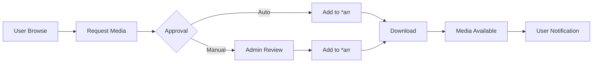

# Jellyseerr - Service Synergy Analysis

## Service Overview
Jellyseerr is a request management and media discovery application that provides a user-friendly interface for requesting movies and TV shows, integrating with Radarr, Sonarr, and Jellyfin.

## Synergies with Other Services

### Strong Integrations
1. **Jellyfin**: User authentication and library status
2. **Radarr**: Automatic movie request processing
3. **Sonarr**: TV show request automation
4. **Home Assistant**: Request notifications and automation
5. **Nginx Proxy Manager**: Secure public access for requests
6. **Tailscale**: Secure remote request access
7. **Glance**: Request queue and approval widgets

### Complementary Services
- **Prowlarr**: Availability checking via indexers
- **Ollama**: Recommendation engine and descriptions
- **Vaultwarden**: Secure user credential storage
- **AdGuard Home**: Safe browsing for users
- **Lidarr**: Music requests (limited support)
- **qBittorrent/NZBGet**: Download status visibility

## Redundancies
- **Ombi**: Alternative request system
- **Overseerr**: Plex-focused alternative
- **Petio**: Another request platform
- **Built-in Request**: Basic Jellyfin requests

## Recommended Additional Services

### High Priority
1. **Overseerr**: Alternative with more features
2. **Ombi**: Mature alternative platform
3. **Requestrr**: Discord/Telegram bot integration
4. **Notifiarr**: Advanced notification system
5. **LunaSea**: Mobile app for management

### Medium Priority
1. **Petio**: Family-friendly request system
2. **Doplarr**: Discord request bot
3. **Mellow**: Discord integration
4. **Invitarr**: User invitation system
5. **Wizarr**: Onboarding system

### Low Priority
1. **Calibre-Web**: Book request system
2. **LazyLibrarian**: Book automation
3. **Mylar3**: Comic book requests
4. **Readarr**: Book/audiobook automation
5. **Gaps**: Collection completion

## Integration Opportunities

### Request Workflow


### User Management
1. **Role-Based Access**:
   - Admin: Full control
   - Power User: Auto-approve
   - User: Request only
   - Guest: Browse only

2. **Request Limits**:
   - Daily/weekly/monthly quotas
   - Quality restrictions
   - 4K request permissions
   - Series vs. movie limits

3. **Approval Rules**:
   - Auto-approve for power users
   - Manual review for new users
   - Quality-based approval
   - Availability checking

## Optimization Recommendations

### Configuration Settings
```yaml
General:
  - Default Permissions: Request only
  - Auto-Approve: Power users
  - 4K Permissions: Admin only
  - Notifications: Email + Discord

Jellyfin:
  - Server URL: Local address
  - External URL: Public domain
  - Libraries: Movies, TV Shows

Radarr/Sonarr:
  - Default Profile: HD-1080p
  - 4K Profile: Separate instance
  - Root Folder: Auto-select
  - Monitor: Yes
```

### Discovery Features
1. **Trending**: Current popular media
2. **Upcoming**: Future releases
3. **Recommendations**: Based on history
4. **Collections**: Franchise discovery
5. **Genres**: Category browsing

### Notification System
```yaml
Notifications:
  Request Submitted:
    - Admin: Email
    - User: In-app
  Request Approved:
    - User: Email + Push
  Media Available:
    - User: All channels
  Failed Download:
    - Admin: Priority alert
```

## Service-Specific Features

### Request Types
- **Movies**: Single film requests
- **TV Shows**: Full series or seasons
- **4K Content**: Separate approval flow
- **Anime**: Special handling for seasons
- **Collections**: Entire franchise requests

### Issue Reporting
1. **Playback Issues**: Stream problems
2. **Subtitle Issues**: Missing/wrong subs
3. **Quality Issues**: Low quality files
4. **Audio Issues**: Wrong language/track
5. **Metadata Issues**: Wrong info/posters

### Advanced Features

#### Discover Sources
- **TMDb Trending**: Current popular
- **TMDb Upcoming**: Future releases
- **Plex Watchlist**: Import from Plex
- **Trakt Lists**: Custom lists
- **IMDb Lists**: Top rated/popular

#### User Features
1. **Watchlist**: Personal queue
2. **Request History**: Track requests
3. **Notifications**: Configurable alerts
4. **Language**: Multi-language UI
5. **Profiles**: Per-user settings

## Integration Patterns

### With Home Assistant
```yaml
Sensors:
  - Pending requests count
  - Available media count
  - User statistics
  - Storage usage

Automations:
  - Alert on new requests
  - Auto-approve trusted users
  - Deny requests when storage low
  - Weekly request reports
```

### With Discord/Telegram
1. **Request Commands**: !request moviename
2. **Status Updates**: Request progress
3. **Notifications**: New media alerts
4. **Browse**: Search from chat
5. **Admin**: Approve from chat

## Performance Optimization

### Caching Strategy
1. **Image Cache**: Poster/backdrop storage
2. **Search Cache**: Recent search results
3. **Metadata Cache**: TMDb/TVDB data
4. **User Cache**: Permission caching
5. **Library Cache**: Jellyfin library state

### Database Management
1. **Regular Cleanup**: Remove old requests
2. **Index Optimization**: Speed up searches
3. **Backup Schedule**: Regular exports
4. **Migration Tools**: Version upgrades
5. **Analytics**: Usage statistics

## User Experience

### Onboarding
1. **Welcome Email**: Instructions
2. **Tutorial**: First-time guide
3. **FAQ Section**: Common questions
4. **Request Guidelines**: Quality/format info
5. **Support Contact**: Help channels

### Mobile Experience
1. **Responsive Design**: Mobile-friendly
2. **PWA Support**: Install as app
3. **Push Notifications**: Mobile alerts
4. **Offline Mode**: Browse cached data
5. **Quick Actions**: Request shortcuts

## Key Findings

### What Needs to Be Done
1. Configure Jellyfin integration for auth
2. Connect Radarr and Sonarr instances
3. Set up user roles and permissions
4. Configure notification channels
5. Customize discovery sources

### Why These Changes Are Beneficial
1. Empowers users to request content
2. Reduces admin burden with automation
3. Provides discovery for new content
4. Manages user expectations
5. Tracks library growth and usage

### How to Implement
1. Deploy Jellyseerr container
2. Connect to Jellyfin for authentication
3. Configure Radarr/Sonarr connections
4. Set up user permission templates
5. Configure notification webhooks
6. Customize UI and branding
7. Set up discovery sources
8. Create request guidelines
9. Test approval workflows
10. Document for end users