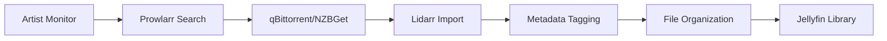

# Lidarr - Service Synergy Analysis

## Service Overview
Lidarr is an automated music collection manager that monitors multiple sources for new releases from your favorite artists, automatically downloading, sorting, and organizing music files.

## Synergies with Other Services

### Strong Integrations
1. **Prowlarr**: Centralized indexer management for music
2. **qBittorrent/NZBGet**: Automated music downloading
3. **Jellyfin**: Music library streaming and management
4. **Home Assistant**: Music automation and notifications
5. **Jellyseerr**: Music request system (limited)
6. **Gluetun**: VPN protection for downloads
7. **Samba**: Direct file access for library management

### Complementary Services
- **Glance**: Artist statistics and new releases
- **Bazarr**: Lyrics fetching (as subtitles)
- **Ollama**: Generate artist bios and album reviews
- **Nginx Proxy Manager**: Secure remote access
- **Tailscale**: Remote music management
- **Vaultwarden**: API key storage

## Redundancies
- **Headphones**: Older music automation alternative
- **Beets**: Command-line music organizer
- **MusicBrainz Picard**: Manual tagging tool
- **Spotify/Apple Music**: Streaming alternatives

## Recommended Additional Services

### High Priority
1. **Beets**: Advanced music organization and tagging
2. **MusicBrainz**: Metadata and acoustic fingerprinting
3. **Navidrome**: Lightweight music server alternative
4. **Airsonic**: Music streaming server
5. **Deemix**: Additional music source

### Medium Priority
1. **Funkwhale**: Federated music platform
2. **Ampache**: Web-based audio streaming
3. **Mopidy**: Extensible music server
4. **Snapcast**: Multi-room audio sync
5. **Volumio**: Audiophile music player

### Low Priority
1. **Subsonic**: Original music streaming server
2. **Koel**: Personal music streaming
3. **Black Candy**: Modern music streamer
4. **Polaris**: Lightweight music server
5. **Groove Basin**: Music player server

## Integration Opportunities

### Music Pipeline


### Quality Management
1. **Format Hierarchy**:
   - FLAC (Lossless) > 320kbps MP3 > V0 MP3
   - Multi-format support
   - Upgrade logic for better quality

2. **Release Types**:
   - Album priority
   - Single/EP handling
   - Compilation management
   - Live album options

3. **Metadata Sources**:
   - MusicBrainz primary
   - Last.fm for scrobbles
   - Discogs for releases
   - AllMusic for reviews

## Optimization Recommendations

### File Organization
```
/media/music/
├── Artist Name/
│   ├── Album Name (Year)/
│   │   ├── 01 - Track Title.flac
│   │   ├── 02 - Track Title.flac
│   │   ├── cover.jpg
│   │   └── album.nfo
│   └── Singles/
```

### Quality Profiles
```yaml
Profiles:
  - Any:
      Formats: MP3, FLAC, AAC
      Bitrate: 128kbps+
  - Lossless:
      Formats: FLAC, ALAC
      Upgrade Until: FLAC
  - Lossy High:
      Formats: MP3-320, MP3-V0
      Size Limits: Yes
```

### Metadata Profiles
1. **Standard**: Album, artist, year, genre
2. **Extended**: Add lyrics, reviews, credits
3. **Minimal**: Basic tags only
4. **Audiophile**: Complete metadata

## Service-Specific Features

### Artist Monitoring
- **Entire Discography**: All releases
- **Future Releases**: Upcoming only
- **Missing Albums**: Gap filling
- **Latest Album**: Most recent only
- **None**: Manual only

### Release Monitoring
```yaml
Options:
  - New Albums: Monitor upcoming
  - Missing Albums: Backfill catalog
  - Existing Albums: Upgrade quality
  - Singles: Optional inclusion
  - EPs: Include or exclude
```

### Import Lists
1. **Spotify Playlists**: Follow playlists
2. **Last.fm User**: Scrobbled artists
3. **MusicBrainz Series**: Collections
4. **Billboard Charts**: Popular music
5. **Custom Lists**: Genre-specific

## Advanced Features

### Metadata Enhancement
1. **AcoustID**: Audio fingerprinting
2. **Cover Art**: Multiple sources
3. **Lyrics**: LRC file support
4. **Reviews**: Critical reception
5. **Credits**: Producer, engineer info

### Multi-Format Strategy
```yaml
Format Handling:
  FLAC:
    - Storage: Archive collection
    - Use: Home listening
  MP3-320:
    - Storage: Mobile sync
    - Use: Portable devices
  MP3-V0:
    - Storage: Streaming cache
    - Use: Bandwidth limited
```

### Integration Patterns

#### With Jellyfin
- Automatic library updates
- Metadata synchronization
- Playlist generation
- Artist radio stations

#### With Home Assistant
```yaml
Automations:
  - New album notifications
  - Artist tour announcements
  - Storage warnings
  - Quality upgrade alerts
  - Failed download retry
```

## Performance Optimization

### Search Efficiency
1. **Artist Aliases**: Handle name variations
2. **Release Groups**: Prefer specific groups
3. **Country Priority**: Local releases first
4. **Label Preferences**: Trusted sources
5. **Format Priority**: Lossless first

### Storage Management
1. **Compression**: FLAC compression levels
2. **Duplicate Detection**: Avoid redundant albums
3. **Format Conversion**: Transcode options
4. **Archive Strategy**: Long-term storage
5. **Cleanup Rules**: Remove upgraded files

## Key Findings

### What Needs to Be Done
1. Configure artist monitoring preferences
2. Set up quality profiles for different uses
3. Configure MusicBrainz integration
4. Set up proper file naming scheme
5. Configure metadata tag preferences

### Why These Changes Are Beneficial
1. Automates music collection building
2. Ensures consistent quality and tagging
3. Discovers new releases automatically
4. Maintains organized music library
5. Enables multi-device streaming

### How to Implement
1. Deploy Lidarr container
2. Connect to Prowlarr for indexers
3. Configure download clients
4. Set up music root folder
5. Create quality profiles
6. Configure metadata profiles
7. Set naming conventions
8. Import existing library
9. Add favorite artists
10. Configure import lists