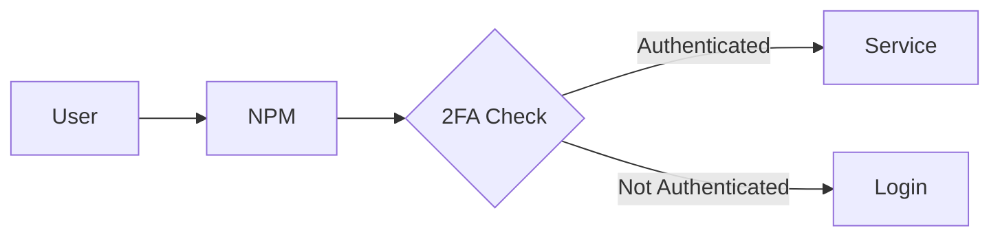

# Nginx Proxy Manager - Service Synergy Analysis

## Service Overview
Nginx Proxy Manager (NPM) provides a user-friendly web interface for managing Nginx reverse proxy configurations, SSL certificates, and access controls for web services.

## Synergies with Other Services

### Strong Integrations
1. **All Web Services**: Provides reverse proxy and SSL for every web-accessible service
2. **AdGuard Home**: DNS resolution for local domains and services
3. **Tailscale**: Secure remote access gateway for services
4. **Home Assistant**: External access with SSL, webhook proxy
5. **Jellyfin**: Streaming optimization, cache configuration
6. **Vaultwarden**: Secure external access for password manager
7. **Glance**: Dashboard access with authentication

### Complementary Services
- **Jellyseerr**: Secure request portal access
- **All *arr Services**: Protected API access
- **Ollama WebUI**: Secure AI interface access
- **qBittorrent**: WebUI protection and access control
- **Samba**: WebDAV interface for file access
- **Byparr**: Proxy configuration for Cloudflare bypass

## Redundancies
- **Tailscale Serve**: Tailscale can provide simple HTTPS
- **Cloudflare Tunnels**: Alternative reverse proxy solution
- **Service Built-in Proxy**: Some services have basic proxy features

## Recommended Additional Services

### High Priority
1. **Authelia/Authentik**: SSO and 2FA authentication provider
2. **Crowdsec**: Intrusion prevention and bot protection
3. **Fail2ban**: Brute force protection
4. **Cloudflare**: CDN and DDoS protection
5. **Let's Encrypt DNS Challenges**: Wildcard certificate automation

### Medium Priority
1. **Traefik**: Alternative with auto-discovery features
2. **Caddy**: Simpler alternative with automatic HTTPS
3. **HAProxy**: Load balancing capabilities
4. **OAuth2 Proxy**: OAuth/OIDC authentication
5. **GeoIP Blocking**: Geographic access restrictions

### Low Priority
1. **Nginx Amplify**: Monitoring and analytics
2. **ModSecurity**: Web application firewall
3. **Nginx Plus**: Commercial features
4. **Kong**: API gateway features
5. **Istio**: Service mesh for microservices

## Integration Opportunities

### Security Enhancements
1. **Multi-layered Authentication**:
   - NPM access lists → Authelia 2FA → Service login
   - IP whitelisting for sensitive services
   - Geo-blocking for regional restrictions

2. **Certificate Management**:
   - Wildcard certificates for *.domain.com
   - Automatic renewal with DNS challenges
   - Certificate transparency monitoring

3. **Access Control**:
   - Different authentication per service
   - Time-based access restrictions
   - Rate limiting per endpoint

### Performance Optimization
1. **Caching Strategies**:
   - Static asset caching for web UIs
   - API response caching where appropriate
   - Media streaming optimization for Jellyfin

2. **Load Distribution**:
   - Round-robin for redundant services
   - Health checks for automatic failover
   - WebSocket support for real-time services

3. **Compression**:
   - Gzip/Brotli for web content
   - Image optimization on-the-fly
   - Bandwidth reduction for remote access

### Advanced Routing
1. **Path-based Routing**:
   ```nginx
   domain.com/jellyfin → Jellyfin
   domain.com/sonarr → Sonarr
   domain.com/radarr → Radarr
   ```

2. **Subdomain Organization**:
   ```
   media.domain.com → Jellyfin
   request.domain.com → Jellyseerr
   manage.domain.com → NPM itself
   ```

3. **API Gateway Features**:
   - Version routing for APIs
   - Request transformation
   - Response manipulation

## Optimization Recommendations

### Architecture
1. **Network Placement**: DMZ or separate VLAN for security
2. **High Availability**: Multiple NPM instances with sync
3. **Backup Strategy**: Configuration export and version control
4. **Monitoring**: Health checks and uptime monitoring

### Configuration Best Practices
1. **SSL/TLS**:
   - Minimum TLS 1.2, prefer 1.3
   - Strong cipher suites only
   - HSTS headers for security
   - OCSP stapling for performance

2. **Headers Management**:
   ```nginx
   X-Frame-Options: DENY
   X-Content-Type-Options: nosniff
   X-XSS-Protection: 1; mode=block
   Content-Security-Policy: [appropriate policy]
   ```

3. **Custom Locations**:
   - WebSocket proxying for real-time services
   - Large file upload limits for media
   - Streaming optimizations for video

### Service-Specific Configurations

#### Jellyfin
```nginx
- Client body size: 50M
- Proxy buffering: off
- WebSocket support: enabled
- Cache: disabled for /Items
```

#### Home Assistant
```nginx
- WebSocket required
- Upgrade/Connection headers
- Long timeout for automations
```

#### *arr Services
```nginx
- API key authentication
- Rate limiting on API endpoints
- Custom base URL support
```

## Integration Patterns

### Single Sign-On Flow


### Multi-Domain Setup
1. **Production**: Direct domain access with full security
2. **Development**: Subdomain with basic auth
3. **Internal Only**: Local domain without external exposure
4. **API Only**: Separate domain with rate limiting

## Key Findings

### What Needs to Be Done
1. Implement wildcard SSL certificate with DNS challenge
2. Deploy Authelia for centralized authentication
3. Configure service-specific proxy optimizations
4. Set up Crowdsec for threat protection
5. Enable detailed access logging and monitoring

### Why These Changes Are Beneficial
1. Provides single entry point for all services
2. Eliminates certificate warnings and improves trust
3. Enables secure remote access without VPN
4. Simplifies domain and subdomain management
5. Improves performance through caching and optimization

### How to Implement
1. Deploy NPM container with persistent volumes
2. Configure DNS A records pointing to server
3. Set up Let's Encrypt with DNS provider API
4. Create proxy hosts for each service
5. Implement Authelia for sensitive services
6. Configure custom Nginx configurations per service
7. Set up monitoring and alerting
8. Document all proxy configurations
9. Test failover and backup procedures
10. Regular security audits and updates