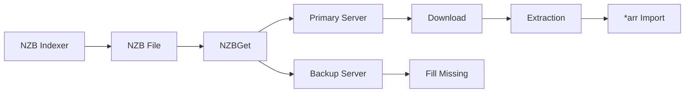

# NZBGet - Service Synergy Analysis

## Service Overview
NZBGet is a high-performance Usenet downloader that efficiently downloads files from Usenet servers using NZB index files, offering an alternative to BitTorrent for content acquisition.

## Synergies with Other Services

### Strong Integrations
1. **Radarr/Sonarr/Lidarr**: Automated Usenet downloading
2. **Prowlarr**: NZB indexer management and search
3. **Gluetun**: VPN protection for Usenet traffic
4. **Samba**: Direct access to download folders
5. **Home Assistant**: Download monitoring and automation
6. **Jellyfin**: Media import after completion
7. **Bazarr**: Trigger subtitle search on completion

### Complementary Services
- **qBittorrent**: Torrent fallback when Usenet fails
- **Glance**: Download statistics dashboard
- **Nginx Proxy Manager**: Secure WebUI access
- **Tailscale**: Remote download management
- **Vaultwarden**: Usenet account credentials
- **AdGuard Home**: DNS for Usenet servers

## Redundancies
- **SABnzbd**: Alternative Usenet downloader
- **qBittorrent**: Overlapping download functionality
- **Newshosting/Eweka Downloaders**: Provider-specific tools
- **Download Station**: NAS-integrated downloaders

## Recommended Additional Services

### High Priority
1. **SABnzbd**: Alternative with different features
2. **NZBHydra2**: Usenet meta-indexer
3. **Usenet Server Blocks**: Multiple providers
4. **Par2 Tools**: Repair incomplete downloads
5. **Unpackerr**: Automated extraction

### Medium Priority
1. **NZBVortex**: Modern Usenet client
2. **Newsbin**: Windows Usenet reader
3. **GrabIt**: Alternative downloader
4. **Alt.Binz**: Another option
5. **NZB Unity**: Browser extension

### Low Priority
1. **Momentum**: Usenet automation
2. **Sick Beard**: Legacy automation
3. **CouchPotato**: Movie automation
4. **Headphones**: Music automation
5. **LazyLibrarian**: Book automation

## Integration Opportunities

### Usenet Architecture


### Provider Strategy
1. **Primary Block**: Unlimited monthly
2. **Backup Block**: Different backbone
3. **Fill Server**: Block account
4. **Speed Priority**: Fastest first
5. **Retention**: Maximize days

### Download Optimization
```yaml
Server Priority:
  Level 0: Primary unlimited (Newshosting)
  Level 1: Secondary unlimited (Eweka)
  Level 2: Block account (Tweaknews)

Connection Settings:
  - Connections: 30-50 per server
  - SSL: Always enabled
  - Port: 563 (SSL)
  - Retention: 3000+ days
```

## Optimization Recommendations

### Performance Configuration
```yaml
Performance:
  Article Cache: 500 MB
  Write Buffer: 1024 KB
  CRC Check: Yes
  Direct Unpack: Yes
  Par Check: Auto
  Par Repair: Yes

Connections:
  Total: 50-100
  Per Server: Based on plan
  SSL Cipher: Fast options
  Timeout: 60 seconds
```

### Category Configuration
```yaml
Categories:
  Movies:
    DestDir: /downloads/movies
    Unpack: Yes
    Extensions: .mkv,.mp4

  TV:
    DestDir: /downloads/tv
    Unpack: Yes
    PostScript: notify.sh

  Music:
    DestDir: /downloads/music
    Unpack: Yes
    Extensions: .mp3,.flac
```

### Post-Processing
1. **Unrar**: Automatic extraction
2. **Par2**: Automatic repair
3. **Cleanup**: Remove RAR/PAR files
4. **Permissions**: Set proper ownership
5. **Scripts**: Custom notifications

## Service-Specific Features

### Queue Management
- **Priority Levels**: High/Normal/Low
- **Pause/Resume**: Individual items
- **Duplicate Detection**: Skip downloads
- **History Retention**: Configurable days
- **Failed Handling**: Retry or mark

### Health Monitoring
```yaml
Monitoring:
  - Server response time
  - Connection success rate
  - Download speed
  - Completion rate
  - Repair success rate

Alerts:
  - Server connection failed
  - Low speed warning
  - Quota approaching
  - Disk space low
```

### Advanced Features

#### Scheduler
```yaml
Speed Limits:
  Peak Hours:
    Time: 18:00-23:00
    Speed: 5 MB/s
  Off Hours:
    Time: 23:00-18:00
    Speed: Unlimited

Server Scheduling:
  - Enable/disable by time
  - Quota management
  - Priority changes
```

#### RSS Automation
1. **Feed Configuration**: Multiple feeds
2. **Filters**: Regex matching
3. **Duplicate Check**: Prevent redownload
4. **Quality Priority**: Prefer better
5. **Category Assignment**: Auto-sort

## Integration Patterns

### With *arr Services
```yaml
Download Client Settings:
  Host: nzbget
  Port: 6789
  Username: [user]
  Password: [pass]
  Category: movies/tv/music
  Priority: Normal
  Add Paused: No
```

### With Automation
```yaml
Home Assistant:
  Sensors:
    - Download speed
    - Queue size
    - Free space
    - Monthly usage

  Automations:
    - Pause on streaming
    - Resume at night
    - Alert on failures
    - Quota warnings
```

## Performance Comparison

### vs BitTorrent
**Advantages**:
- Consistent max speed
- No seeding required
- Better for older content
- SSL encryption standard
- No ratio requirements

**Disadvantages**:
- Requires paid service
- Limited to retention period
- No rare content
- Monthly quotas

## Troubleshooting

### Common Issues
1. **Incomplete Downloads**: Add backup server
2. **Slow Speeds**: Check connections limit
3. **Failed Repairs**: Insufficient PAR2 files
4. **Extraction Failures**: Disk space/permissions
5. **Connection Drops**: SSL cipher issues

### Optimization Tips
1. **Connection Tuning**: Test optimal count
2. **Cache Size**: Based on RAM
3. **Direct Unpack**: Saves disk I/O
4. **Article Read**: Adjust chunk size
5. **Priority Servers**: Order by speed

## Key Findings

### What Needs to Be Done
1. Configure multiple Usenet providers
2. Optimize connection settings
3. Set up categories for organization
4. Configure post-processing scripts
5. Integrate with *arr services

### Why These Changes Are Beneficial
1. Provides fast, consistent downloads
2. Complements torrent availability
3. Better for older content
4. No upload requirements
5. Encrypted by default

### How to Implement
1. Deploy NZBGet container
2. Configure Usenet provider accounts
3. Set up server priorities
4. Configure categories
5. Connect to Radarr/Sonarr
6. Set up post-processing
7. Configure speed scheduling
8. Test download pipeline
9. Monitor usage/quotas
10. Document provider details