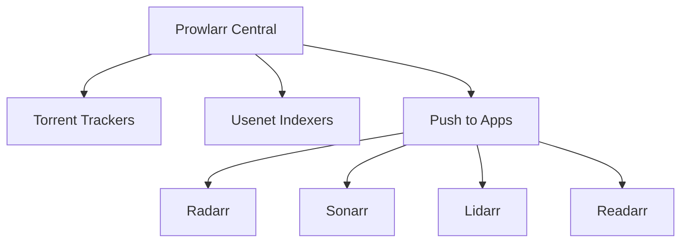

# Prowlarr - Service Synergy Analysis

## Service Overview
Prowlarr is an indexer manager that integrates with various torrent trackers and Usenet indexers, providing a single interface for all *arr applications to search for content.

## Synergies with Other Services

### Strong Integrations
1. **Radarr/Sonarr/Lidarr**: Centralized indexer management for all *arr apps
2. **qBittorrent**: Direct torrent sending and management
3. **NZBGet**: Automatic NZB file handling
4. **Gluetun**: VPN protection for indexer searches
5. **Byparr**: Cloudflare bypass for protected indexers
6. **Home Assistant**: Search statistics and monitoring

### Complementary Services
- **Jellyseerr**: Search results for request decisions
- **Bazarr**: Subtitle indexer searches
- **AdGuard Home**: Block malicious indexer redirects
- **Glance**: Indexer status dashboard widgets
- **Vaultwarden**: Secure storage of indexer credentials
- **Nginx Proxy Manager**: Secure API access

## Redundancies
- **Built-in Indexers**: Each *arr app has basic indexer support
- **Jackett**: Older alternative indexer proxy
- **NZBHydra2**: Alternative focusing on Usenet

## Recommended Additional Services

### High Priority
1. **FlareSolverr**: Cloudflare challenge solver (if not using Byparr)
2. **NZBHydra2**: Specialized Usenet indexer aggregation
3. **Jackett**: Legacy compatibility for some indexers
4. **BitTorrent DHT**: Decentralized torrent search
5. **Custom Indexer Proxies**: For specific private trackers

### Medium Priority
1. **Cardigann**: Custom indexer definitions
2. **Torznab Proxies**: API compatibility layers
3. **RSS Bridge**: Convert sites to RSS feeds
4. **WebOAClient**: OAuth for indexer authentication
5. **IndexerManager**: Backup indexer management

### Low Priority
1. **MetaSearch**: Meta-indexer aggregation
2. **TorrentAPI**: Programmatic torrent search
3. **UsenetCrawler**: Specialized Usenet search
4. **NZBFinder**: Alternative NZB search
5. **DogNZB**: Premium Usenet indexer

## Integration Opportunities

### Indexer Architecture


### Sync Configuration
1. **Automatic Sync**:
   - Push indexers to all *arr apps
   - Sync categories and capabilities
   - Update API limits and rates
   - Share health status

2. **Search Optimization**:
   - Query caching to reduce API hits
   - Parallel searches across indexers
   - Result deduplication
   - Quality score calculation

3. **Failover Management**:
   - Automatic indexer rotation
   - Health-based prioritization
   - Alternative indexer fallback
   - Rate limit management

## Optimization Recommendations

### Indexer Management
```yaml
Indexer Configuration:
  - Priority Tiers:
      Tier 1: Private trackers
      Tier 2: Semi-private
      Tier 3: Public trackers
  - Rate Limits:
      API Calls: Respect limits
      Grabbing: Stagger requests
  - Categories:
      Movies: 2000-2999
      TV: 5000-5999
      Music: 3000-3999
```

### Performance Tuning
1. **Caching**: Enable result caching (15 minutes)
2. **Parallel Searches**: Limit concurrent searches
3. **Timeout Settings**: Balance speed vs. reliability
4. **Database Optimization**: Regular cleanup and indexing
5. **API Rate Limiting**: Prevent indexer bans

### Security Configuration
1. **API Keys**: Unique keys per *arr application
2. **IP Restrictions**: Limit to local network
3. **HTTPS Only**: Encrypted API communication
4. **Credential Storage**: Environment variables
5. **Audit Logging**: Track all searches and grabs

## Service-Specific Benefits

### For *arr Applications
- **Unified Management**: One place for all indexers
- **Automatic Sync**: No manual configuration
- **Health Monitoring**: Disable failing indexers
- **Search Aggregation**: Better content discovery
- **Statistics**: Track indexer performance

### For Download Clients
- **Smart Routing**: Best indexer for content
- **Format Support**: Torrent and NZB handling
- **Quality Matching**: Appropriate quality selection
- **Duplicate Prevention**: Avoid redundant downloads

### For Users
- **Simplified Setup**: Configure once, use everywhere
- **Better Results**: Aggregated search results
- **Reliability**: Automatic failover
- **Cost Optimization**: Track indexer usage

## Implementation Patterns

### Tiered Search Strategy
```yaml
Search Priority:
  1. Private Trackers:
     - Best quality
     - Retention rules
     - Faster speeds
  2. Usenet:
     - Older content
     - Completion guarantee
     - No seeding required
  3. Public Trackers:
     - Fallback option
     - Recent releases
     - Free access
```

### Category Mapping
```yaml
Prowlarr Categories:
  Movies: [2000, 2010, 2020, 2030]
  TV: [5000, 5030, 5040, 5045]
  Music: [3000, 3010, 3030, 3040]
  Books: [7000, 7020, 8010]
  Software: [4000, 4010, 4030]
```

### Health Management
1. **Monitoring**: Check indexer response times
2. **Auto-Disable**: Disable on repeated failures
3. **Recovery**: Re-enable after cooldown
4. **Alerting**: Notify on indexer issues
5. **Statistics**: Track success rates

## Advanced Features

### Custom Indexers
1. **Cardigann Definitions**: Support exotic indexers
2. **API Proxies**: Work around restrictions
3. **RSS Feeds**: Convert to searchable indexers
4. **Web Scraping**: Extract from HTML sites
5. **Aggregate APIs**: Combine multiple sources

### Search Enhancement
1. **Query Manipulation**: Improve search terms
2. **Result Filtering**: Remove fake/spam
3. **Score Adjustment**: Custom ranking
4. **Cache Sharing**: Between applications
5. **Trending Analysis**: Popular content discovery

## Key Findings

### What Needs to Be Done
1. Set up Prowlarr as central indexer manager
2. Configure both torrent and Usenet indexers
3. Connect all *arr applications for sync
4. Implement FlareSolverr or Byparr for Cloudflare
5. Set up monitoring and statistics

### Why These Changes Are Beneficial
1. Simplifies indexer management across services
2. Improves content discovery success rates
3. Reduces manual configuration overhead
4. Provides unified search statistics
5. Enables intelligent failover and load balancing

### How to Implement
1. Deploy Prowlarr container
2. Add torrent tracker accounts
3. Configure Usenet indexers if available
4. Set up FlareSolverr/Byparr for protection
5. Connect to Radarr, Sonarr, Lidarr
6. Configure download client integration
7. Set up category mappings
8. Test search functionality
9. Monitor indexer health
10. Document indexer credentials securely