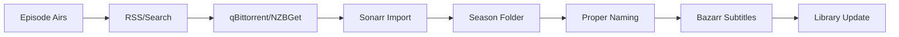

# Sonarr - Service Synergy Analysis

## Service Overview
Sonarr is an automated TV series collection manager that monitors multiple RSS feeds and torrent/Usenet sites for new episodes, automatically downloading, sorting, and renaming them.

## Synergies with Other Services

### Strong Integrations
1. **Prowlarr**: Centralized indexer management for TV searches
2. **qBittorrent/NZBGet**: Automated episode downloading
3. **Jellyfin**: TV library management and streaming
4. **Bazarr**: Automatic subtitle fetching for episodes
5. **Jellyseerr**: TV show request and approval system
6. **Home Assistant**: Episode monitoring and notifications
7. **Gluetun**: VPN protection for downloads

### Complementary Services
- **Glance**: Calendar widgets for upcoming episodes
- **Radarr**: Movie companion for complete media
- **Samba**: Direct file access for management
- **Ollama**: Generate episode descriptions
- **Nginx Proxy Manager**: Secure remote access
- **Tailscale**: Remote series management

## Redundancies
- **SickBeard/SickRage**: Older alternatives
- **Medusa**: Another TV automation tool
- **Manual RSS**: Basic torrent RSS feeds
- **Jellyfin DVR**: Live TV recording overlap

## Recommended Additional Services

### High Priority
1. **Overseerr**: Alternative request interface
2. **Plex Meta Manager**: Collection organization
3. **Tdarr**: Automated transcoding for episodes
4. **FileBot**: Advanced episode renaming
5. **SonarrSync**: Multi-instance synchronization

### Medium Priority
1. **Trakt**: Watch history and list sync
2. **TheTVDB/TMDb**: Metadata providers
3. **Episode Butler**: Missing episode finder
4. **DizqueTV**: Create fake TV channels
5. **Organizr**: Unified management dashboard

### Low Priority
1. **Sonarr4K**: Separate 4K instance
2. **Anime Sonarr**: Specialized for anime
3. **Episode Tracking**: Advanced statistics
4. **Subtitle Edit**: Manual subtitle timing
5. **Commercial Skip**: Ad detection/removal

## Integration Opportunities

### Episode Pipeline


### Series Management
1. **Season Monitoring**:
   - All Episodes
   - Future Episodes
   - Missing Episodes
   - Pilot Episode
   - Latest Season
   - None

2. **Quality Progression**:
   - HDTV → WEB-DL → BluRay
   - Upgrade until cutoff
   - Prefer season packs

3. **Release Timing**:
   - Grab immediately
   - Wait for better quality
   - Delay for subtitles

## Optimization Recommendations

### File Organization
```
/media/tv/
├── Show Name (Year)/
│   ├── Season 01/
│   │   ├── Show Name S01E01 - Episode Title.mkv
│   │   ├── Show Name S01E01 - Episode Title.srt
│   │   └── metadata/
│   ├── Season 02/
│   ├── poster.jpg
│   ├── banner.jpg
│   └── tvshow.nfo
```

### Quality Profiles
```yaml
Profiles:
  - Any:
      Min: HDTV-720p
      Max: BluRay-1080p
      Preferred: WEB-DL-1080p
  - HD-1080p:
      Min: WEB-720p
      Max: BluRay-1080p
      Upgrade Until: WEB-DL-1080p
  - Anime:
      Min: HDTV-720p
      Max: BluRay-1080p
      Prefer: Dual Audio
```

### Release Profiles
1. **Preferred Words**:
   - Season pack (+100 score)
   - Proper/Repack (+50)
   - x265/HEVC (+25)

2. **Must Contain**:
   - For anime: Dual Audio
   - For documentaries: DOCU

3. **Must Not Contain**:
   - Hardcoded subs
   - Sample
   - Extras

## Service-Specific Features

### Series Types
- **Standard**: Regular TV shows
- **Daily**: Talk shows, news
- **Anime**: Special numbering (absolute)
- **Mini-Series**: Limited episodes

### Monitoring Strategies
```yaml
New Series:
  - Monitor: All Episodes
  - Search: Missing episodes

Continuing Series:
  - Monitor: Future Episodes
  - Search: Via RSS

Ended Series:
  - Monitor: None
  - Search: Manual only
```

### Season Pack Handling
1. **Detection**: Identify full season releases
2. **Import**: Extract all episodes
3. **Upgrade**: Replace individual episodes
4. **Storage**: Prefer packs for efficiency
5. **Seeding**: Consider ratio requirements

## Advanced Automation

### Smart Episode Management
1. **Airing Schedule**:
   - Track air dates/times
   - Handle timezone conversions
   - Manage mid-season breaks

2. **Quality Decisions**:
   - Quick grab HDTV for immediate viewing
   - Upgrade to WEB-DL when available
   - Archive with BluRay eventually

3. **Special Handling**:
   - Double episodes
   - Season premieres/finales
   - Special episodes

### Integration Patterns

#### With Jellyseerr
```yaml
Workflow:
  1. User requests show
  2. Jellyseerr approves
  3. Sonarr adds series
  4. Monitors future episodes
  5. Auto-downloads on release
```

#### With Home Assistant
```yaml
Notifications:
  - New episode downloaded
  - Season complete
  - Show canceled/ended
  - Failed downloads
  - Storage warnings
```

## Performance Optimization

### RSS Sync
- **Interval**: 15-30 minutes
- **Categories**: TV only
- **Quality**: Match profiles
- **Delay**: Optional quality wait

### Import Settings
- **Episode Title Required**: No (for early releases)
- **Skip Free Space Check**: Context-dependent
- **Minimum Age**: 0-30 minutes
- **Recycle Bin**: 7 days retention

## Key Findings

### What Needs to Be Done
1. Configure series quality profiles
2. Set up proper season folder structure
3. Create release profiles for preferences
4. Configure RSS sync intervals
5. Set up series type detection

### Why These Changes Are Beneficial
1. Automates episode downloading completely
2. Maintains consistent library organization
3. Ensures best available quality
4. Reduces missing episode hunting
5. Handles complex TV scheduling

### How to Implement
1. Deploy Sonarr container
2. Connect to Prowlarr for indexers
3. Configure download clients
4. Set up TV library root folder
5. Create quality profiles
6. Configure release profiles
7. Set naming conventions
8. Add favorite shows
9. Configure calendar connections
10. Set up notifications