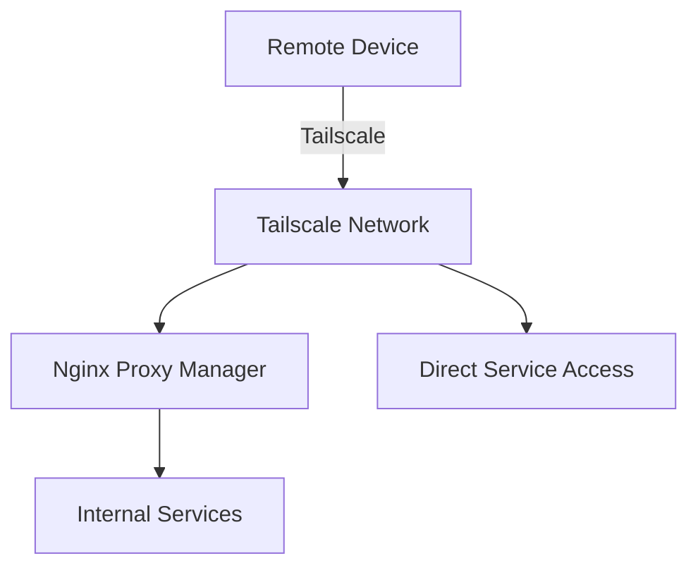

# Tailscale - Service Synergy Analysis

## Service Overview
Tailscale is a zero-configuration VPN service built on WireGuard that creates a secure mesh network between devices, enabling secure remote access without traditional port forwarding.

## Synergies with Other Services

### Strong Integrations
1. **Nginx Proxy Manager**: Secure gateway for Tailscale-only access to services
2. **Home Assistant**: Remote automation control, presence detection for Tailscale devices
3. **Jellyfin**: Secure media streaming without port forwarding
4. **All Web Services**: Private access without public exposure
5. **Samba**: Secure file sharing across Tailscale network
6. **AdGuard Home**: DNS resolution for Tailscale devices
7. **Vaultwarden**: Secure password manager access from anywhere

### Complementary Services
- **Glance**: Dashboard access from remote locations
- **qBittorrent**: Remote torrent management
- **All *arr Services**: Remote media management
- **Ollama WebUI**: Secure AI access from anywhere
- **Gluetun**: Complementary VPN for different purposes
- **Jellyseerr**: Remote media requests

## Redundancies
- **Traditional VPN**: Replaces need for OpenVPN/WireGuard setup
- **Port Forwarding**: Eliminates need for router port forwarding
- **Cloudflare Tunnels**: Alternative secure access method

## Recommended Additional Services

### High Priority
1. **Headscale**: Self-hosted Tailscale control server
2. **Tailscale Funnel**: Share services with non-Tailscale users
3. **Tailscale SSH**: Secure SSH without keys
4. **MagicDNS**: Automatic DNS for Tailscale network
5. **Exit Nodes**: Route traffic through home network

### Medium Priority
1. **Subnet Routers**: Access non-Tailscale devices
2. **Tailscale ACLs**: Granular access control
3. **Netmaker**: Alternative mesh VPN
4. **ZeroTier**: Alternative mesh network
5. **Nebula**: Slack's mesh VPN solution

### Low Priority
1. **WireGuard Direct**: For specific use cases
2. **OpenVPN**: Legacy compatibility
3. **SoftEther**: Multi-protocol VPN
4. **Pritunl**: Enterprise VPN features

## Integration Opportunities

### Access Architecture


### Security Layers
1. **Zero Trust Network**:
   - Device authentication via Tailscale
   - Service authentication via NPM/Authelia
   - Application authentication per service

2. **Split Access**:
   - Public: NPM with full authentication
   - Private: Tailscale-only for trusted devices
   - Hybrid: Tailscale Funnel for sharing

3. **Network Segmentation**:
   - Management services: Tailscale-only
   - Media services: Tailscale + public option
   - Development: Tailscale exclusive

### Automation Possibilities
1. **Presence Detection**: Know when family connects remotely
2. **Conditional Access**: Services available based on connection
3. **Bandwidth Management**: Adjust quality for remote streaming
4. **Security Alerts**: Notify on new device connections
5. **Automatic Backups**: Trigger when specific devices connect

## Optimization Recommendations

### Network Configuration
1. **Subnet Routing**: Access entire home network
2. **Exit Node**: Use home internet from anywhere
3. **DNS Configuration**: Use AdGuard through Tailscale
4. **Split DNS**: Different resolution for Tailscale clients

### Performance Optimization
1. Enable DERP relay optimization
2. Configure direct connections when possible
3. Use appropriate MTU settings
4. Enable key rotation for security
5. Optimize for specific use cases (streaming vs. files)

### Service Integration
1. **Tailscale Serve**: Expose services directly
   ```bash
   tailscale serve https / http://localhost:8096  # Jellyfin
   tailscale serve https /npm http://localhost:81  # NPM
   ```

2. **Tailscale Funnel**: Public sharing when needed
   ```bash
   tailscale funnel 443 http://localhost:8096
   ```

3. **ACL Configuration**:
   ```json
   {
     "groups": {
       "group:family": ["user1", "user2"],
       "group:admin": ["admin@domain"]
     },
     "acls": [
       {"action": "accept", "users": ["group:family"], "ports": ["*:443"]},
       {"action": "accept", "users": ["group:admin"], "ports": ["*:*"]}
     ]
   }
   ```

## Service-Specific Benefits

### Media Services
- **Jellyfin**: Direct streaming without transcoding limits
- **Jellyseerr**: Secure request portal for family
- ***arr Stack**: Remote management without exposure

### Infrastructure
- **NPM**: Secure management interface
- **Home Assistant**: Full control from anywhere
- **AdGuard**: Use home DNS filtering remotely

### Storage
- **Samba**: Access files like local network
- **qBittorrent**: Manage downloads remotely
- **Vaultwarden**: Sync passwords securely

## Implementation Patterns

### Hybrid Access Model
1. **Internal**: Direct service access
2. **Tailscale**: Full access for trusted devices
3. **Public + Auth**: Limited services with authentication
4. **Funnel**: Temporary sharing with others

### Service Priority
1. **Tailscale-Only**: Management interfaces, sensitive data
2. **Dual Access**: Media services, convenience tools
3. **Public-First**: Guest services, information displays

## Key Findings

### What Needs to Be Done
1. Configure Tailscale with subnet routing for full network access
2. Set up exit node for secure browsing from anywhere
3. Implement ACLs for granular access control
4. Configure MagicDNS with AdGuard integration
5. Create service-specific access policies

### Why These Changes Are Beneficial
1. Eliminates need for port forwarding (security)
2. Provides secure access from anywhere
3. Simplifies remote access for family members
4. Reduces attack surface of exposed services
5. Enables location-independent homelab management

### How to Implement
1. Install Tailscale container or system package
2. Authenticate with Tailscale account
3. Configure as subnet router for LAN access
4. Set up exit node capability
5. Configure ACLs for user groups
6. Integrate with AdGuard for DNS
7. Set up Tailscale Serve for specific services
8. Document access methods for family
9. Test failover scenarios
10. Monitor connection logs for security