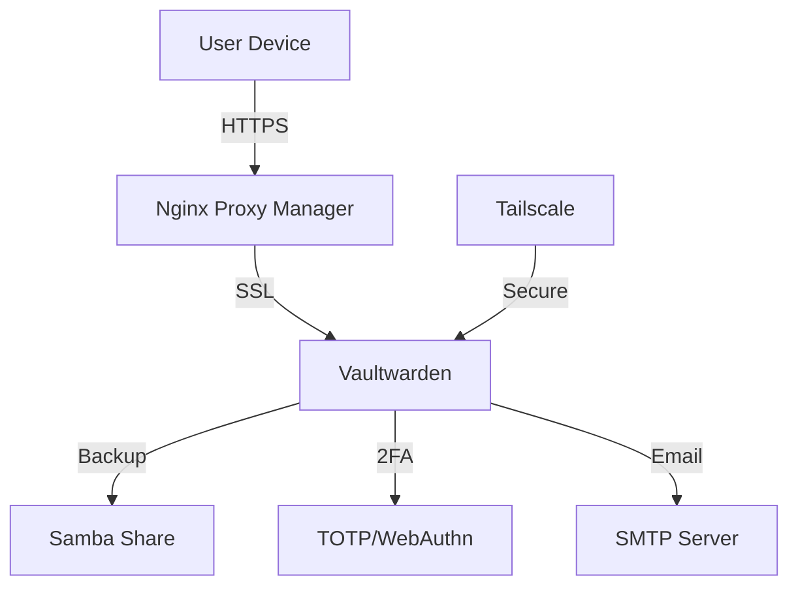

# Vaultwarden - Service Synergy Analysis

## Service Overview
Vaultwarden is a lightweight, self-hosted password manager server compatible with Bitwarden clients, providing secure password storage, sharing, and synchronization across devices.

## Synergies with Other Services

### Strong Integrations
1. **Nginx Proxy Manager**: Secure HTTPS access essential for passwords
2. **Tailscale**: Secure remote access without public exposure
3. **Home Assistant**: Credential storage for integrations
4. **All Services**: API key and password management
5. **AdGuard Home**: Protection from phishing sites
6. **Samba**: Backup destination for vault exports
7. **Glance**: Quick access links and status

### Complementary Services
- **Jellyfin**: Streaming service credentials
- **Prowlarr**: Indexer account credentials
- **qBittorrent**: Tracker passwords
- **Ollama**: API keys for AI services
- **Radarr/Sonarr**: Service API keys
- **Jellyseerr**: User account management

## Redundancies
- **Browser Password Managers**: Less secure alternatives
- **KeePass**: Offline alternative
- **Bitwarden Cloud**: Cloud-hosted version
- **1Password**: Commercial alternative

## Recommended Additional Services

### High Priority
1. **Bitwarden Directory Connector**: LDAP/AD sync
2. **Backup Solutions**: Automated vault backups
3. **YubiKey Support**: Hardware 2FA tokens
4. **SMTP Server**: Email notifications
5. **Fail2ban**: Brute force protection

### Medium Priority
1. **Authelia**: Additional authentication layer
2. **PostgreSQL**: Alternative to SQLite
3. **Redis**: Performance caching
4. **Prometheus**: Metrics monitoring
5. **Keycloak**: SSO integration

### Low Priority
1. **Passbolt**: Team-focused alternative
2. **Psono**: Another password manager
3. **TeamPass**: Collaborative passwords
4. **PassCore**: Password reset portal
5. **GoPass**: CLI password manager

## Integration Opportunities

### Security Architecture


### Credential Management
1. **Service Categories**:
   - Infrastructure: Server, network passwords
   - Media Services: Streaming, indexer accounts
   - Development: API keys, tokens
   - Personal: Email, banking, social
   - Shared: Family passwords

2. **Access Control**:
   - Personal vaults
   - Shared collections
   - Organization vaults
   - Emergency access
   - Send feature for sharing

3. **Security Policies**:
   - Master password requirements
   - 2FA enforcement
   - Session timeout
   - IP restrictions
   - Failed login limits

## Optimization Recommendations

### Security Configuration
```yaml
Security:
  Admin Token: Long random string
  Signup: Disabled
  Invitations: Admin only
  2FA: Required
  Password Iterations: 100000+

HTTPS:
  Force: Always
  HSTS: Enabled
  Certificate: Let's Encrypt

Rate Limiting:
  Login Attempts: 5
  Timeout: 900 seconds
  IP Blocking: Fail2ban
```

### Backup Strategy
1. **Database Backups**: Daily SQLite dumps
2. **Attachment Backups**: Include file storage
3. **Configuration**: Backup env settings
4. **Encrypted Exports**: Regular JSON exports
5. **Offsite Storage**: Cloud backup copy

### Performance Tuning
```yaml
Database:
  Type: PostgreSQL (for scale)
  Connections: Pool management
  Indexes: Optimize queries

Caching:
  Icons: Cache locally
  Static Files: Browser cache
  Sessions: Redis optional

Resources:
  RAM: 256MB minimum
  CPU: Low usage
  Storage: Depends on attachments
```

## Service-Specific Features

### Vault Types
1. **Personal Items**: Private passwords
2. **Organizations**: Team sharing
3. **Collections**: Grouped credentials
4. **Folders**: Organization structure
5. **Sends**: Temporary sharing

### Item Types
- **Login**: Username/password
- **Card**: Payment cards
- **Identity**: Personal information
- **Secure Note**: Encrypted text
- **TOTP**: 2FA codes

### Advanced Features

#### Emergency Access
```yaml
Setup:
  - Trusted Contact: Family member
  - Wait Time: 7 days
  - Access Type: View or takeover
  - Notification: Email alerts
```

#### Attachment Storage
1. **File Types**: Any file type
2. **Encryption**: AES-256
3. **Size Limits**: Configurable
4. **Organization**: Per item
5. **Sharing**: With vault item

## Integration Patterns

### With Home Assistant
```yaml
Uses:
  - Integration credentials
  - API tokens
  - Device passwords
  - Service accounts
  - Webhook URLs

Security:
  - Read-only API access
  - Specific collection access
  - Audit logging
```

### With Media Services
1. **Indexer Accounts**: Tracker credentials
2. **Streaming Services**: Account sharing
3. **API Keys**: Service integration
4. **Download Clients**: WebUI passwords
5. **Request Portals**: User accounts

## High Availability

### Redundancy Options
1. **Database Replication**: PostgreSQL clustering
2. **File Sync**: Attachment replication
3. **Load Balancing**: Multiple instances
4. **Backup Instances**: Standby servers
5. **Disaster Recovery**: Quick restore

### Sync Strategy
```yaml
Clients:
  - Desktop: Real-time sync
  - Mobile: Push notifications
  - Browser: WebSocket updates
  - CLI: API polling

Conflicts:
  - Last write wins
  - Version history
  - Conflict detection
  - Manual resolution
```

## Monitoring & Maintenance

### Health Checks
1. **Service Status**: Uptime monitoring
2. **Database Health**: Connection checks
3. **Disk Usage**: Attachment storage
4. **SSL Certificates**: Expiry monitoring
5. **Backup Success**: Verification

### Security Auditing
1. **Login Attempts**: Track failures
2. **Password Changes**: Audit trail
3. **Sharing Events**: Monitor access
4. **API Usage**: Rate limiting
5. **Breach Monitoring**: HaveIBeenPwned

## Key Findings

### What Needs to Be Done
1. Deploy with strong admin token
2. Configure HTTPS with valid certificates
3. Enable 2FA for all users
4. Set up automated backups
5. Implement fail2ban protection

### Why These Changes Are Beneficial
1. Centralizes password management securely
2. Eliminates password reuse risks
3. Enables secure password sharing
4. Provides offline access capability
5. Maintains complete data ownership

### How to Implement
1. Deploy Vaultwarden container
2. Configure strong admin token
3. Set up NPM reverse proxy with SSL
4. Disable open registration
5. Create user accounts via invitation
6. Configure SMTP for notifications
7. Set up automated backups
8. Enable 2FA enforcement
9. Configure fail2ban
10. Document recovery procedures